# UI design review: a consistent, easier UI with settings in the toolbar popup

- **Issue:** #7. Inputs are #6 (map preview placement, decided) and the store readiness spec, `docs/superpowers/specs/2026-10-09-store-readiness-design.md` on the `store-readiness-spec` branch.
- **Date:** 2026-10-09
- **Status:** proposal for the owner. Section 9 lists the decisions to take. Section 10 drafts the follow-up issues for Phases 5 to 9.
- **Deliverables:** this document, static mockups in `docs/design/mockups/`, and screenshots in `docs/design/images/`. Section 11 explains how to regenerate them.

## Contents

1. [Summary](#1-summary)
2. [Current state](#2-current-state)
3. [Design principles](#3-design-principles)
4. [Shared style](#4-shared-style)
5. [Theme: light and dark](#5-theme-light-and-dark)
6. [Per-surface proposals](#6-per-surface-proposals)
7. [Accessibility testing](#7-accessibility-testing)
8. [Fit with the spec](#8-fit-with-the-spec)
9. [Decisions needed from the owner](#9-decisions-needed-from-the-owner)
10. [Proposed follow-up issues](#10-proposed-follow-up-issues)
11. [Regenerating the images](#11-regenerating-the-images)

## 1. Summary

The extension adds seven kinds of UI to Services Directory pages, plus the toolbar popup and the options page. Each one styles itself, and several cover the page, work only with a mouse, or announce nothing to a screen reader. The proposal gives them one small style with an `sdt-` prefix, a teal accent that stays clear of the page's blue links, and system type with monospace for identifiers. It also sets one rule for placement: the extension's UI stays in the page flow or in a column the page gives up, and only the map preview floats.

For settings, the recommendation is option 2 from issue #7. The popup gets three quick switches built from the Phase 4 schema, saved as soon as they change, plus "All settings" and a "Reload page" button, and the options page keeps the full form.

The in-page additions match the host page's own background, so they stay light on the usual light pages and turn dark on dark ones. The popup and options page follow the system setting. Every colour pair passes WCAG 2.2 AA in both palettes (116 checks), and axe-core with the WCAG 2.2 AA tags finds no violations in any mockup in either scheme.

## 2. Current state

All "before" screenshots come from today's code (`design-review-ui` at `6c330c3`) loaded into Playwright's Chromium against the fake ArcGIS Server in `tests/fixtures/`. The page stylesheet is replaced with an invented stand-in, `docs/design/mockups/host-standin.css`, so the pages look like a plausible Services Directory. Problems are listed most serious first. Finding IDs refer to Appendix A of the spec.

### 2.1 Toolbar popup

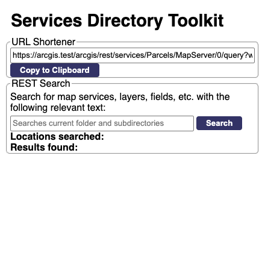 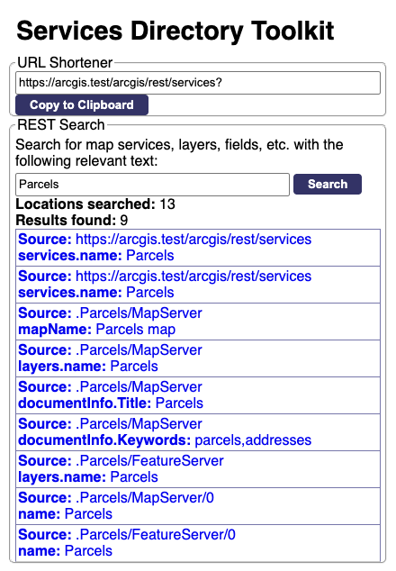

1. **Search can hang.**
   - An invalid regular expression throws after the button is disabled, leaving it on "Scanning" (`search.js:198-207`, POP-2).
   - `ajax` swallows a non-JSON response, after which the crawl never finishes and the button stays on "Scanning" (`search.js:18-39`, `search.js:166-188`, POP-1).
   - A number-only search is compared with `===` and never matches (`search.js:203-205`, POP-3).
2. **Nothing is labelled.** The page has no `lang` (`page_action.html:2`). The URL box has no label (`page_action.html:14`) and the search box has only a placeholder (`page_action.html:22`). "Locations searched" and "Results found" are bold text with no live region (`page_action.html:25-26`). These are POP-8.
3. **An empty search shows an `alert()`** (`search.js:219`). The Search button sits in a `<form>` with no `type`, so it can submit and reload the popup (`page_action.html:18-23`, POP-10).
4. **Results are hard to read.** Each one shows "Source:" and the raw JSON path, such as `documentInfo.Keywords:` (`search.js:91-95`), and the same service appears twice. A click can open two tabs, because each link has `target="_blank"` (`search.js:89`) and also a `chrome.tabs.create` listener (`search.js:180-185`, POP-5).
5. **The URL shortener leaves a stray `?`** (visible in the second picture) and uses unanchored regular expressions (`url_shortener.js:26-45`, POP-7). Copy uses `execCommand` and reports success only by changing the button text (`url_shortener.js:73-84`).
6. **The look is heavy.** A 1.8em title takes the top of the popup (`page_action.css:9-12`). Buttons are bold white on navy (`page_action.css:24-32`) and results sit in blue boxes (`page_action.css:41-49`). There is no way to reach the settings (Phase 3 adds an Options link).

### 2.2 Gear, status icon and the in-page settings form

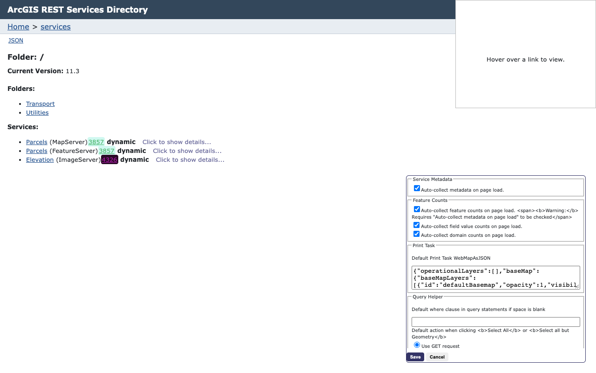

1. **The page can drive the form and click the gear.** The click handler covers the whole status node (`status.js:91`). These are SEC-1 and ADV-3, and Phase 3 removes the form.
2. **The spinning cog is the only loading signal.** It turns while any `loading-*` class is on `<body>` (`inject.css:176-184`), says nothing in words, ignores reduced motion, and has no `alt` (`status.js:61-63`). These are SET-7 and ADV-11.
3. **It covers the page.** The 50 × 50 px icon is fixed 22 px from the bottom-right corner at 50% opacity (`inject.css:120-131`, `inject.css:192-203`). At 800 × 600 it sits on the Query Helper's Select Distinct button (`images/before-query-helper-800.png`). On a dark page it almost disappears (`images/before-root-dark.png`).
4. **The form shows raw markup.** Labels from `src/src/config/options.json` contain HTML, which appears as text, for example `<b>Warning:</b>...` (`status.js:171`, SET-5). Cancel doesn't revert (`status.js:260-263`, SET-6). A missing config raises an `alert()` (`status.js:108`). The form also opens over the page at 30% width and 50% height.
5. **After Phase 3 a gear would mislead.** Once the form is gone, a gear that does nothing still looks like a settings button.

### 2.3 Spatial reference badges

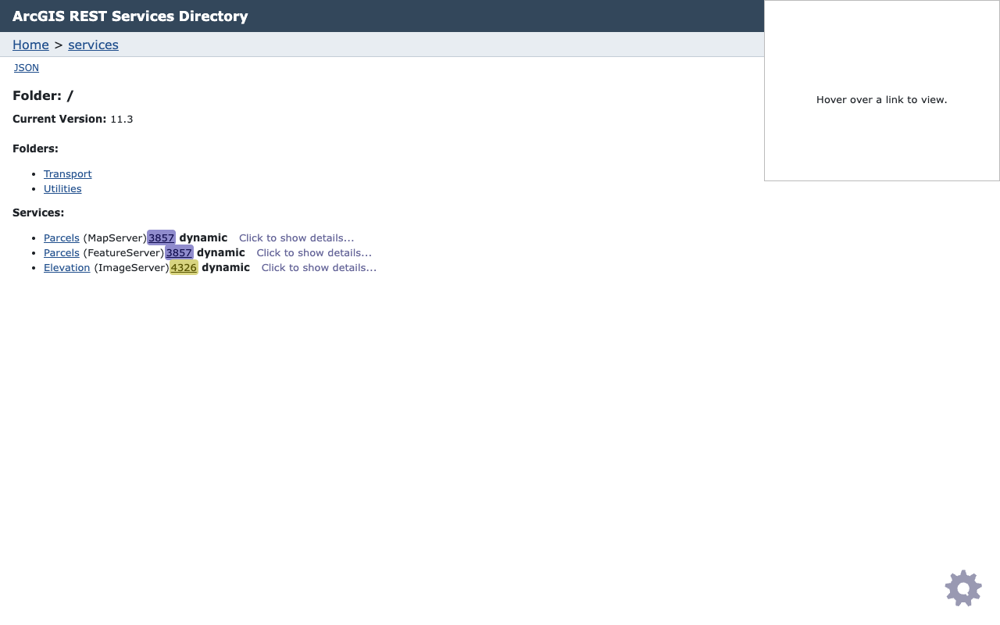

1. **Colours are random.** `getColor` picks a random colour per WKID on each page load (`inject.js:114-118`, INJ-8). 3857 is purple in one capture and green in the next (compare `before-root.png` with `before-settings-form.png`), and about half the colours fail contrast. The colour is set with an inline style string (`inject.js:158`).
2. **"tiled" or "dynamic" appears on every service** that has a spatial reference, FeatureServer and ImageServer included (`inject.js:174`, INJ-14). It is bold, so it outweighs the service name.
3. **The link says only "3857".** A screen reader hears "3857, link" with no context (`inject.js:162-165`). The URL uses the page's protocol and an unencoded value (`inject.js:163`, INJ-14).
4. **Spacing and fallback text.** The badge touches "(MapServer)". A spatial reference with no WKID or WKT would print the literal text `&nbsp;No valid spatial reference available &nbsp;` (`inject.js:149`).

### 2.4 Service and layer details

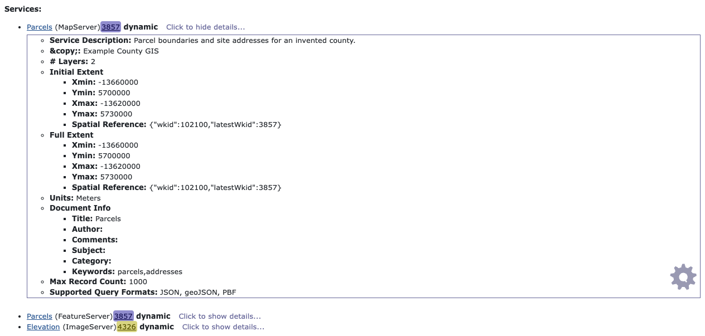

1. **The toggle isn't operable from the keyboard or by a screen reader.** It is a `
` with a click handler (`inject.js:325`), its label is CSS `::before` text (`inject.css:9-14`, `inject.css:21-23`), and its `tabIndex` is -1 (measured, INJ-9).
2. **A click anywhere in the open block closes it** (`inject.js:325`), so selecting a value to copy collapses the list.
3. **The text is broken in places.** The copyright label is a literal `&copy;:` (`inject.js:248`, INJ-11), and server HTML in descriptions appears as text.
4. **The list is long and flat.** Every label is bold. Extents are nested lists, objects print as `JSON.stringify` output (`inject.js:84`), and every true flag gets its own bold line (`inject.js:318-322`). Max Record Count only appears when `documentInfo` exists (`inject.js:274-279`, INJ-13).
5. **The background is hard-coded white** (`inject.css:6`), so on a dark page the toggle is a white chip (`images/before-root-dark.png`).

### 2.5 Feature, field and coded-value counts

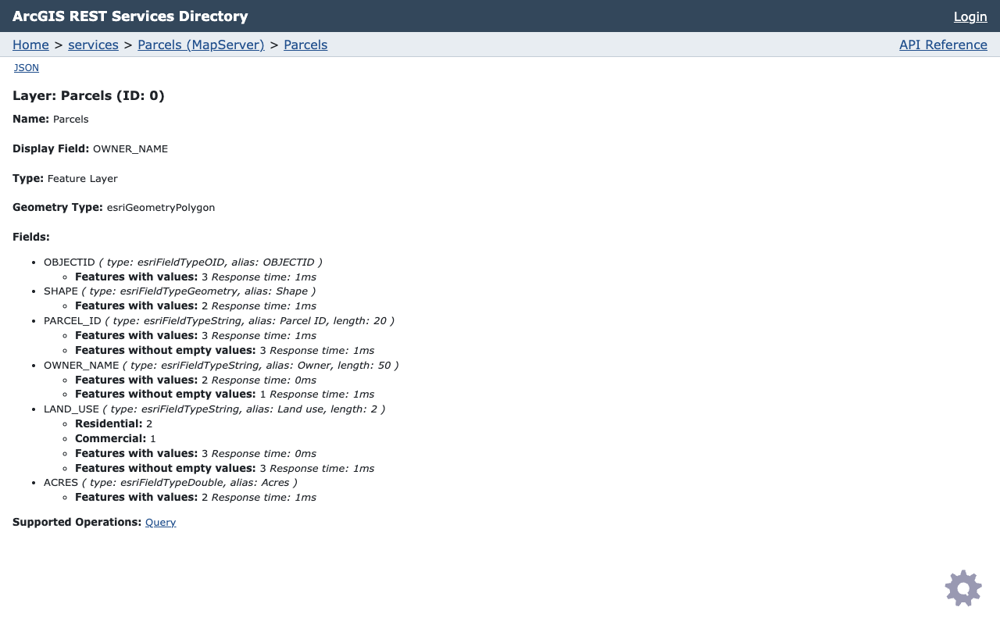

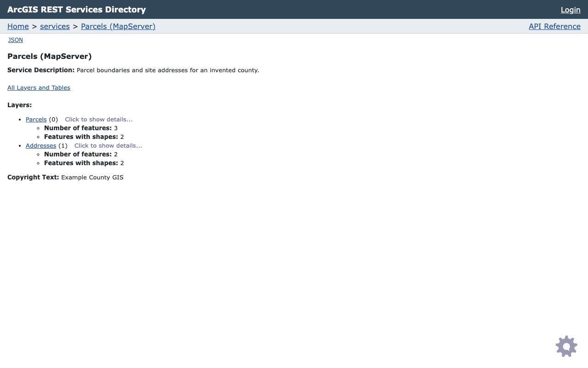

1. **Zero is a red "!!!"** (`inject.js:479`, `inject.js:497`, `inject.js:544`). `#f00` on white is 4.0:1, under the 4.5:1 that SC 1.4.3 asks for, and "!!!" means nothing to a screen reader, so the warning rests on colour alone (SC 1.4.1).
2. **The wording is long.** Each field gets "Features with values: 3 Response time: 1ms" and "Features without empty values: 3" (`inject.js:476-499`). Coded values show the name without the code (`inject.js:541`).
3. **Errors dump the error object** as a nested list (`inject.js:216`) in `#d00` on `#fcc` (`inject.css:108-112`), which is 3.6:1.
4. **Counting is automatic, one request at a time and unbounded.** There is one request per field and per coded value (`inject.js:461-564`, INJ-4, ADV-5). One failure stalls the chain (INJ-2), and counts attach to fields by position (INJ-7).
5. **Progress shows only as the spinning gear,** with no total and no end.

### 2.6 Query Helper and Find Helper

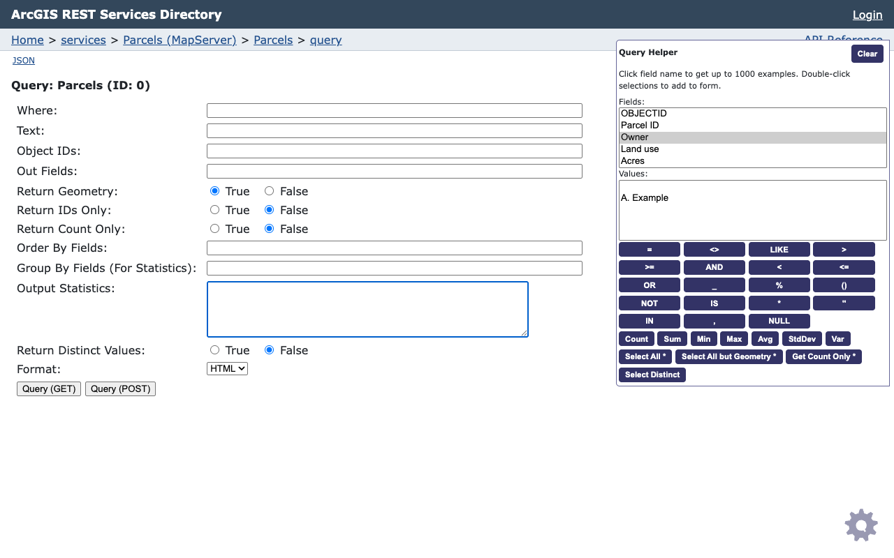

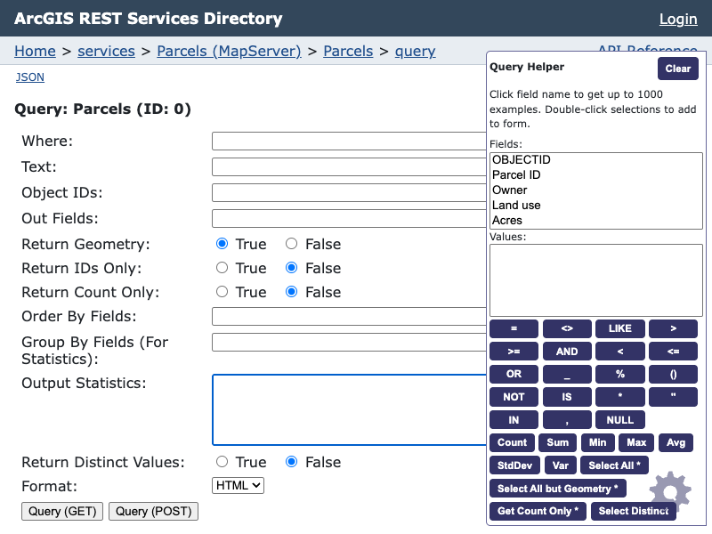

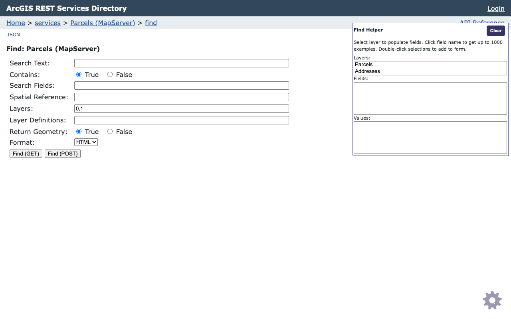

1. **The panel floats over the form.** It is fixed at the right, 30% wide, 5em from the top, with no maximum height (`inject.css:37-51`, QRY-8). At 800 × 600 it covers the right half of every input. A field under it can take keyboard focus while hidden, which fails SC 2.4.11. At 1280 px it clips the API Reference link.
2. **It works only with a mouse.** Values go in on double-click only (`queryTest.js:425-427`, QRY-6). The lists are labelled by loose `` text and a `title` (`queryTest.js:396-418`, QRY-7). The field list is disabled while values load, so keyboard focus drops (`queryTest.js:478`).
3. **The target is unclear.** Text goes into whichever box last lost focus (`queryTest.js:315-317`, QRY-9), and "Clear" empties it without saying which (`queryTest.js:92-96`).
4. **The buttons are small.** SQL buttons measure 88 × 21 px at 1280 and 55 × 21 px at 800, under the 24 px of SC 2.5.8. They pass only through the spacing exception, with rows about 25 px apart. The visible text drops spaces and the inserted text hides in the `name` attribute (`queryTest.js:283-289`). The statistic buttons appear only while Output Statistics has focus (`queryTest.js:254-271`).
5. **The asterisk on auto-submit buttons is explained only in a `title`** (`queryTest.js:206`, `queryTest.js:539-541`).
6. **The default where clause goes into the page by itself** (`queryTest.js:512-522`, SEC-2).
7. **The Find Helper throws when no box had focus** (INJ-3) and fills the Layers box without saying so (`inject.js:847-852`). It shares every panel problem above (INJ-10).

### 2.7 Print task dropdowns

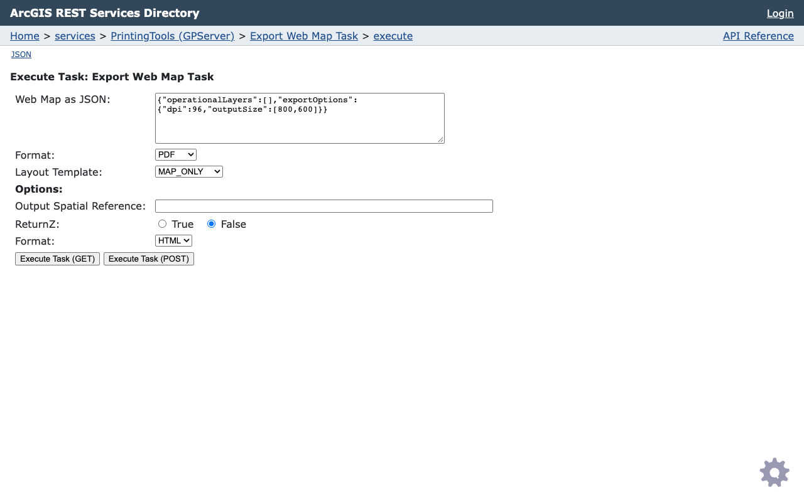

1. **The new `<select>` has no label.** The page's `<label for>` still points at the hidden box (`printTask.js:104-142`, PRT-6).
2. **The saved web map goes into the page by itself** (`printTask.js:169-176`, SEC-2). The old default holds an `http://` basemap URL (`options.js:37`).
3. **Non-GP pages and JSON results raise `alert()`** (`printTask.js:157`, `printTask.js:181`, PRT-1).
4. **The first parameter never gets "Other..."**, because `forEach` passes the index as `addOther` (`printTask.js:167`, PRT-5). Choosing "Other..." doesn't move focus. Hiding uses a generic `hidden` class (`printTask.js:65`, `inject.css:114-118`, INJ-19).
5. **The controls look fine.** Native selects sit in the form without clashing.

### 2.8 Map preview

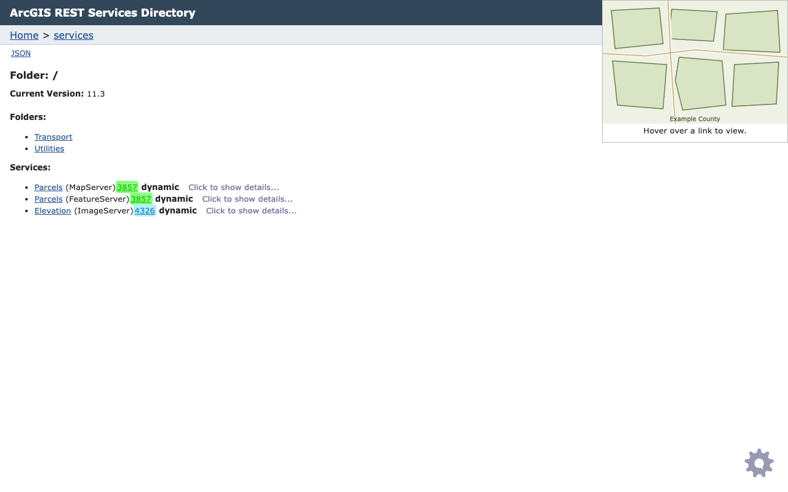

1. **The panel covers the page's links before anyone hovers.** It is fixed at the top right and always present on pages with map links, over Login and API Reference (`inject.css:216-230`, `mapImages.js:172-184`, IMG-3), as `before-root.png` shows too.
2. **It sits far from the link and works only with a mouse** (`mapImages.js:215`, IMG-7). It has no delay or cancellation (IMG-2).
3. **The alt text is "Map image goes here"** (`mapImages.js:179`). "Hover over a link to view." stays under the image. On a dark page that caption takes the page's light text colour on a white panel and vanishes (`images/before-root-dark.png`).
4. **Elements are found by id** (`mapImages.js:130`, `mapImages.js:142`, ADV-10), and stored sizes go into a style string (`mapImages.js:174`, SEC-3).

### 2.9 Options page

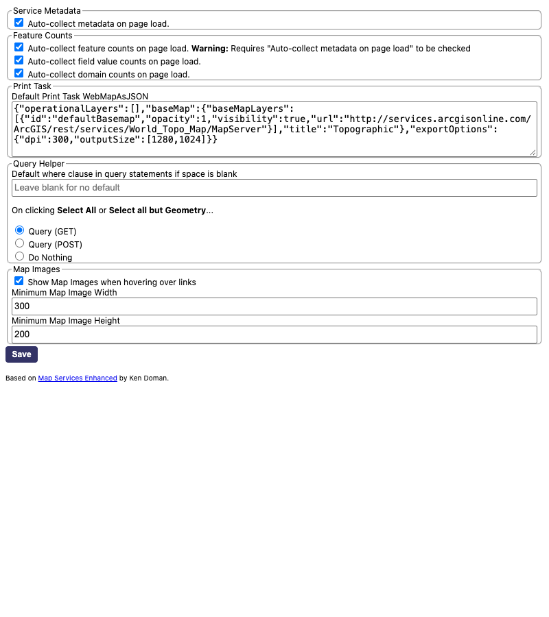

1. **It crashes when `nothing` is stored** (`options.js:53`, SET-1). A blank number saves `NaN` (`options.js:13`, SET-3).
2. **Structure is missing.** There is no `lang` (`options.html:2`). The Select All question is a `
` with no fieldset of its own (`options.html:76-82`), and the warning text sits inside a checkbox label (`options.html:51`).
3. **The form is unstyled,** with full-width inputs and no hierarchy. Size labels say "Minimum Map Image Width" with no unit (`options.html:91-94`).
4. **Saving reports only through the button text**, "Options saved." for 0.8 s (`options.js:18-23`), and there is no error path.

### 2.10 On a dark page

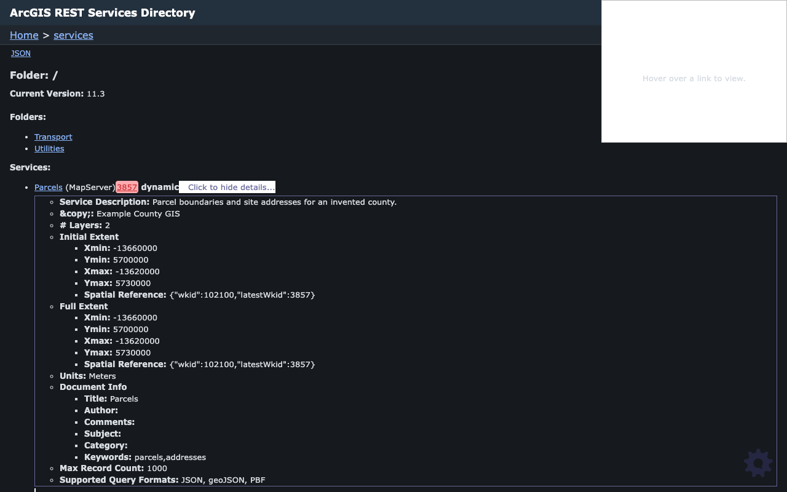

Nothing in today's CSS knows about dark pages. The details chip and preview panel stay white, the preview caption disappears, and the gear fades into the background.

## 3. Design principles

The people using this are GIS developers and administrators checking services: what a service is, how big it is, whether its data is clean, and how to query it. They read dense, small-type pages and often come back to the same servers.

1. **Annotate in place, cover nothing.** Facts sit next to what they describe: badges after the link, details under the row, counts beside the field. Panels take a column the page gives up. Only the map preview floats, and it follows #6.
2. **Colour only where it means something.** Annotations use small muted text and neutral badges. Colour is kept for spatial references, warnings and errors, and every warning or error carries an icon and words as well.
3. **Say what happened.** Every surface has words for loading, empty, failed, partial and server pushback. A spinner never stands alone.
4. **Ask before spending requests.** Work past the request budget, and the expensive value counts, start from a button that says what it will do.
5. **The keyboard is a first-class input.** Native elements, visible focus, Enter wherever double-click works, and live regions for anything that changes.
6. **Mark what the toolkit added.** One accent, one glyph and a left rule set the extension's additions apart, at sizes that sit beside the page's own text.

## 4. Shared style

The proposal is `docs/design/mockups/sdt.css`. It is written to be copied into the extension in Phase 5 with few changes.

### 4.1 Where it lives and how it applies

- **Files.** Phase 5 adds `src/src/lib/sdt.css`, listed first in the content-script `css` array and loaded with `<link>` by `page_action.html` and `options.html`. The spec's lib folder holds classic scripts, and `sdt.css` would be its first stylesheet.
- **Root class.** Every element the extension adds carries `sdt` on its outermost node, plus a component class. `.sdt` sets font, size, line height, colour, text alignment and `color-scheme`, so page CSS on `body` doesn't leak in. Components set every property they rely on.
- **Prefix.** Classes are `sdt-component`, `sdt-component__part` and `sdt-component--variant`. Custom properties are `--sdt-*`. State goes in ARIA attributes (`aria-expanded`, `aria-invalid`, `aria-busy`, `aria-disabled`) or `data-tone`, which keeps the styles tied to what assistive technology hears.
- **Isolation.** Light DOM with prefixed classes, as Phase 2 already plans. Open shadow roots would isolate the panels completely, but the manifest's content-script stylesheet doesn't reach into a shadow root. Each root would then need a stylesheet built from a CSS string. Revisit shadow roots if real servers' CSS breaks the panels.
- **Compatibility.** Nothing needs more than Chrome 120. The style avoids `light-dark()`, which arrived in Chrome 123, and CSS nesting.

### 4.2 Tokens

**Colour.** Light values sit on `:root`. Dark values sit under `prefers-color-scheme: dark` on extension pages and under `html[data-sdt-theme="dark"]` in host pages (section 5).

| Token | Light | Dark | Use |
|---|---|---|---|
| `--sdt-bg` | `#ffffff` | `#1b2020` | Panels, popup, pop-up, fields |
| `--sdt-bg-subtle` | `#f4f6f6` | `#232a2a` | Details body, status bar, page background of extension pages |
| `--sdt-bg-selected` | `#e1f1ef` | `#1f3a37` | Selected option, insertion target |
| `--sdt-fg` | `#1c2121` | `#e6ebea` | Text |
| `--sdt-fg-muted` | `#4f5a59` | `#a7b2b1` | Hints, labels in details, annotations |
| `--sdt-border` | `#d3dad9` | `#3a4443` | Separators (decorative) |
| `--sdt-border-strong` | `#7b8786` | `#7f8c8b` | Control borders, neutral badges, switch off |
| `--sdt-accent` | `#0d6b66` | `#4fc3b8` | Primary buttons, switches, quiet buttons, the left rule |
| `--sdt-accent-hover` | `#0a5853` | `#74d3ca` | Hover |
| `--sdt-on-accent` | `#ffffff` | `#0b1f1d` | Text and thumb on accent |
| `--sdt-focus` | `#1a5fb4` | `#8ab4f8` | Focus ring |
| `--sdt-warn-bg`, `-fg`, `-border` | `#fff3cd`, `#6a4a00`, `#9a6b00` | `#3b2f0c`, `#ffd36b`, `#b8952e` | Zero counts, budget reached, partial failure |
| `--sdt-error-bg`, `-fg`, `-border` | `#fdecea`, `#a3220f`, `#c13b25` | `#3d1c18`, `#ffb3a6`, `#d9705f` | Failures, invalid fields |
| `--sdt-ok-fg` | `#1d6b34` | `#7fd69a` | Done icon |
| `--sdt-sr0` to `--sdt-sr7` (`-bg`, `-fg`, `-border`) | 8 tints | 8 shades | Spatial reference badges (6.4) |

**Type.**

| Token | Value | Use |
|---|---|---|
| `--sdt-font-sans` | `system-ui, -apple-system, "Segoe UI", Roboto, "Helvetica Neue", Arial, sans-serif` | All UI text |
| `--sdt-font-mono` | `ui-monospace, "SF Mono", Menlo, Consolas, "Liberation Mono", monospace` | WKIDs, field names, SQL, URLs, extents, numbers (with tabular figures) |
| `--sdt-text-xs` | 0.75rem (12 px) | Annotations, badges, hints |
| `--sdt-text-s` | 0.8125rem (13 px) | In-page base |
| `--sdt-text-m` | 0.875rem (14 px) | Popup and options base, panel titles |
| `--sdt-text-l` | 1rem | Options section titles |
| `--sdt-text-xl` | 1.375rem | Options page title |
| `--sdt-leading` | 1.45 | Line height |

System type keeps the extension's text distinct from the page's Verdana-style text without looking foreign. Sizes match the page's 12 to 13 px, which keeps annotations quiet, and use `rem` units, which follow the browser's text size setting.

**Space, shape, size, motion.**

| Token | Value |
|---|---|
| `--sdt-space-1` to `--sdt-space-6` | 2, 4, 8, 12, 16, 24 px |
| `--sdt-radius-s`, `-m`, `-l` | 3 px (badges), 6 px (buttons, fields), 10 px (pop-up, cards) |
| `--sdt-target` | 1.5rem: the minimum height and width of anything clickable (SC 2.5.8) |
| `--sdt-focus-width`, `--sdt-focus-offset` | 2 px solid outline, 2 px offset, drawn with `outline` so forced colours keep it |
| `--sdt-panel-width` | 20rem |
| `--sdt-duration` | 120 ms, and none under `prefers-reduced-motion` |
| `--sdt-z-panel`, `--sdt-z-pop` | Near the top of the z-index range, because the page's values are unknown |

### 4.3 Contrast

`docs/design/scripts/check-contrast.js` reads the token blocks from `sdt.css` and checks 58 pairs in each palette: 116 checks, none failing. "page" means the host page's background (white, or the dark stand-in `#16191d`). The lowest result in each group:

| Group | Needs | Lowest light | Lowest dark |
|---|---|---|---|
| Text on the extension's surfaces (fg, muted, accent, warn, error) | 4.5:1 | 5.44 (accent on selected) | 5.61 (muted on selected) |
| Text on the host page | 4.5:1 | 6.34 (accent) | 8.10 (muted) |
| Primary button text | 4.5:1 | 6.34 | 8.01 |
| Spatial reference badge text | 4.5:1 | 6.22 (palette 3) | 8.67 (palette 5) |
| Control borders and switch off | 3:1 | 3.43 (on subtle) | 4.20 (on subtle) |
| Focus ring | 3:1 | 5.80 | 6.94 |
| Spatial reference badge borders | 3:1 | 3.42 (palette 3 in details) | 3.68 (palette 6 in details) |

For comparison, today's zero marker is 4.0:1 and today's error text is 3.6:1. Run the script for the full table.

### 4.4 Components

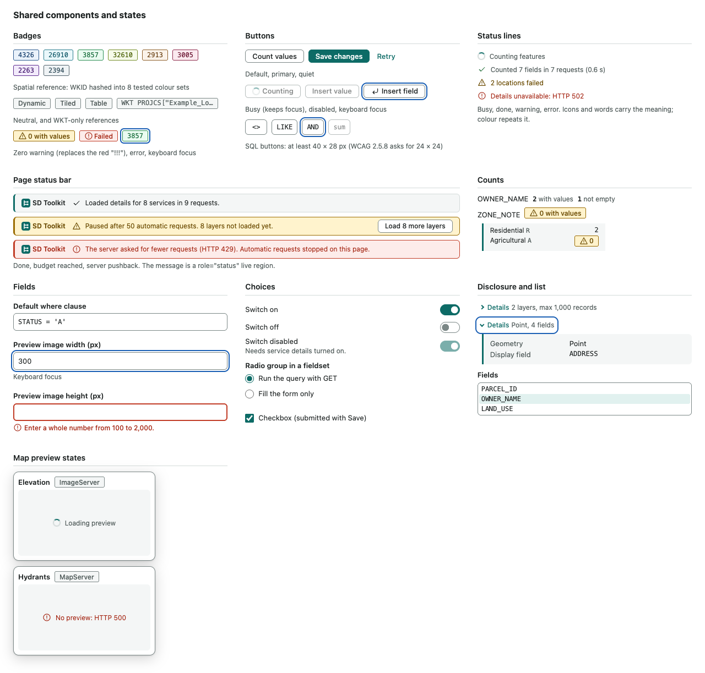

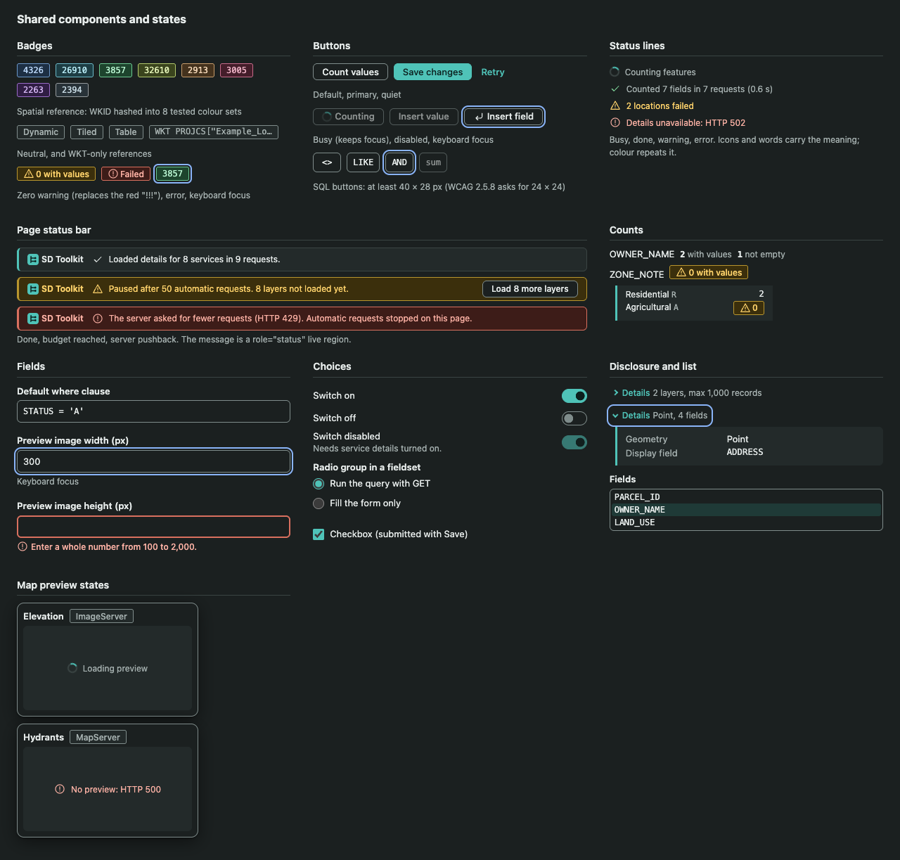

Source: `docs/design/mockups/components.html`.

| Component | Classes | Notes |
|---|---|---|
| Panel | `sdt-panel`, `__head`, `__title`, `__body`, `__section`, `--docked`, `--collapsed` | An `<aside>` named by its `<h2>`. When docked, `html` gets `sdt-docked`, which pads the page by the panel width. The body scrolls inside the panel. |
| Badge | `sdt-badge`, `--sr`, `--sr0` to `--sr7`, `--warn`, `--error` | 20 px tall, 12 px text, 1 px border that meets 3:1. Spatial reference badges use monospace. |
| Button | `sdt-button`, `--primary`, `--quiet`, `--sql` | At least 24 px; SQL buttons 40 × 28 px. While busy a button keeps focus with `aria-disabled="true"`; `disabled` is used only when the action can't run. |
| Compact list | `sdt-list`, `sdt-list--counts`, `sdt-dl`, `sdt-results` | Definition grid for details, two-column counts for coded values, result links in the popup. |
| Status line | `sdt-status` with `data-tone` busy, ok, warn or error | Icon plus words. The message element is the `role="status"` live region. |
| Status bar | `sdt-statusbar`, `__name`, `__actions` | The page-level line under the heading (6.3). |
| Disclosure | `sdt-details`, `--inline`, `__meta`, `__body`, `__group` | Native `
`/`
`, so the expanded state is exposed for free. |
| Field | `sdt-field`, `sdt-input`, `sdt-select`, `sdt-textarea`, `sdt-listbox`, `sdt-hint`, `sdt-error`, `sdt-check`, `sdt-fieldset`, `sdt-switch` | Visible label, hint and error tied by `aria-describedby`; invalid fields get `aria-invalid` and a 2 px error border. The switch is a native checkbox with `role="switch"`. |
| Pop-up | `sdt-popover`, `__head`, `__media`, `__foot` | The map preview (6.8). |
| Glyph | `sdt-glyph` | A placeholder mark until the Track S artwork exists. |

Icons are 16 px stroked SVGs built with `createElementNS` from path data in a lib helper (`SDT.icon("warn")`). Each sits next to words and has `aria-hidden="true"`.

## 5. Theme: light and dark

### 5.1 Extension pages

The popup and the options page follow `prefers-color-scheme` and declare `color-scheme: light dark`, so native controls and scroll bars match.

### 5.2 In-page additions: three options

| Option | On a light page with a light system | On a light page with a dark system (common) | On a dark page | Verdict |
|---|---|---|---|---|
| **Match the host page** | Light | Light | Dark | Always matches what's under it |
| Follow the system | Light | Dark panels on a white page | Matches only if the system is dark | Clashes in the most common mismatch |
| Always light | Light | Light | White chips and panels on a dark page, as today (`before-root-dark.png`) | Fails dark-mode users |

**Recommendation: match the host page.** The check lives in `src/src/lib/` as `SDT.theme`:

1. Read `getComputedStyle(document.body).backgroundColor`. If it is transparent, use `<html>`'s. If both are transparent, use the canvas colour: dark when `<html>`'s computed `color-scheme` includes `dark`, white otherwise.
2. Pick dark when white text would contrast more than black text with that colour (relative luminance under 0.179).
3. Set `data-sdt-theme="dark"` or `"light"` on `<html>`. The content-script CSS keys its dark tokens to `html[data-sdt-theme="dark"]`.
4. If `--sdt-fg-muted` would fall under 4.5:1 on the measured background (a mid-grey page), also set `data-sdt-contrast="more"`, which makes muted text use `--sdt-fg`. `prefers-contrast: more` does the same.
5. Watch for change with one `MutationObserver` on `<html>` attributes and `<head>` children, debounced to 500 ms, and re-run the check.

The decision is a pure function of a colour and gets a `node --test` unit test with a table of backgrounds.

**Dark-mode tools.**

- **Chrome's auto dark mode** recolours at paint time and leaves computed styles alone. With `Emulation.setAutoDarkModeOverride` on, `body` still computes to `rgb(255, 255, 255)` and `prefers-color-scheme: dark` stays false. The toolkit keeps its light palette, and Chrome darkens the page and the additions together. `images/after-services-root-auto-dark.png` shows the result, which stays consistent and readable.
- **Dark Reader** in its default mode rewrites the page's real CSS. The computed background turns dark and the toolkit switches to its dark palette. Chrome keeps the manifest's content-script stylesheet out of `document.styleSheets` (checked: `inject.css` applies on the fake root page, and only `main.css` is listed), so Dark Reader has none of the toolkit's rules to rewrite. Its generic rules on `input`, `select` and `button` have lower specificity than the `.sdt-*` classes. Turning Dark Reader on after the page loads changes `<html>` attributes and adds `<style>` elements to `<head>`, which the watcher in step 5 catches. The Dark Reader points need a manual check with it installed; a headless run here couldn't load it.

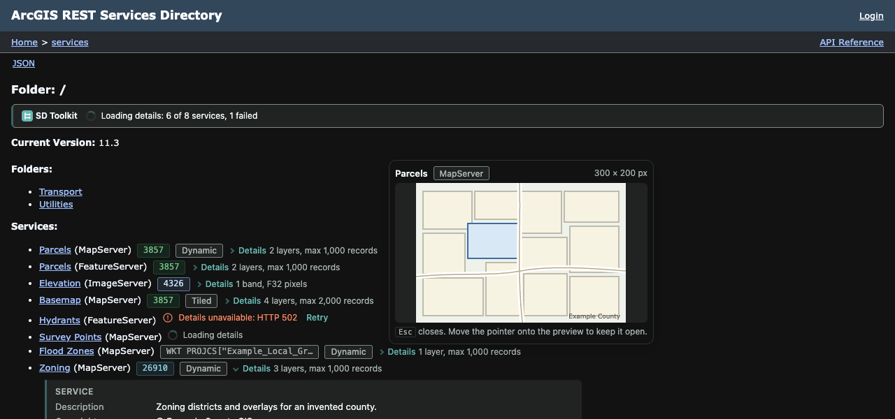

### 5.3 A theme setting

**Recommendation: no theme setting in 2.0.0.** Both automatic rules are predictable, and each setting costs a schema entry, an options control, popup design and tests. If the page check turns out wrong on real servers, add one key, `inPageTheme` with Match page, Light and Dark, to the Phase 4 schema and the options page. The popup and options page would keep following the system.

### 5.4 Badges, forced colours and motion

- The eight badge colour sets have dark variants (section 4.3).
- Under `forced-colors: active`, badges, buttons, the status bar, the pop-up and the docked panel get a `CanvasText` border, focus uses `Highlight`, and the switch falls back to a native checkbox.
- Under `prefers-reduced-motion: reduce`, the spinner stops on a static two-quarter ring, and the disclosure chevron and other transitions don't animate.

## 6. Per-surface proposals

Each surface lists its states and an accessibility note. The notes take the WCAG 2.2 AA criteria from issue #7 in the same groups every time. "Shared tokens" means the measured pairs in section 4.3.

### 6.1 Toolbar popup

| A. On a query page | B. Searching | C. Finished, setting changed |
|---|---|---|
| 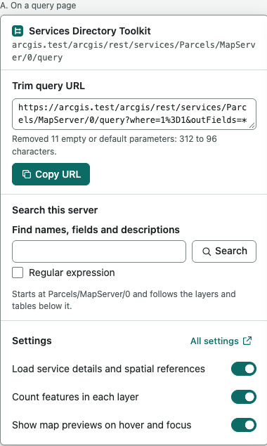 | 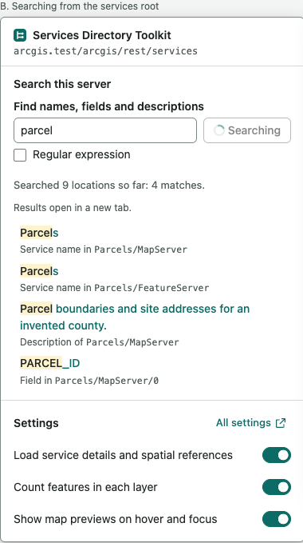 | 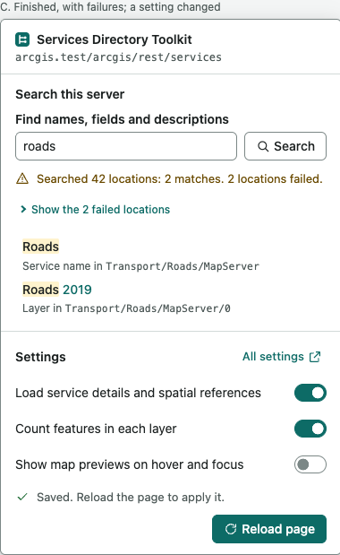 |

| D. Problems | E. No matches | A, dark |
|---|---|---|
| 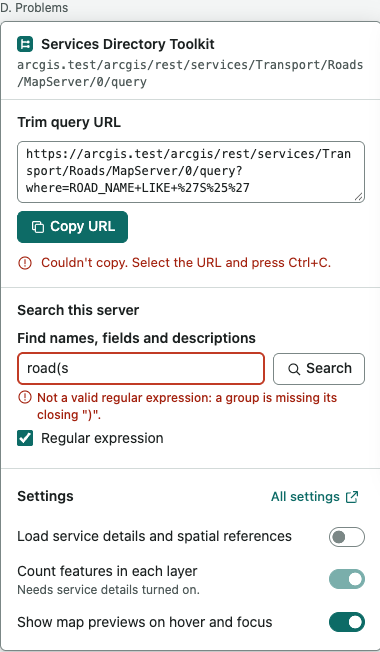 | 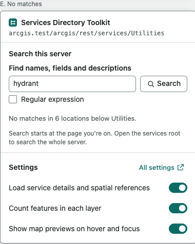 | 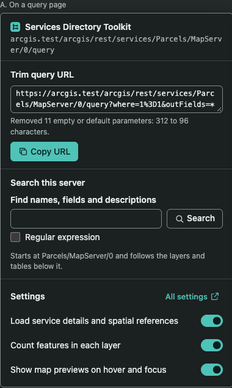 |

Source: `docs/design/mockups/popup.html`. Every frame also exists as `after-popup-*-dark.png`.

**Layout**, 23.75rem (380 px) wide, top to bottom:

1. **Header:** the glyph, "Services Directory Toolkit" at 14 px, and the active tab's host and path in small monospace. The path tells you where a search starts.
2. **Trim query URL** (Phase 9's new name), shown only when the URL has something to remove, as today. A read-only two-line box shows the whole trimmed URL, with a line saying how many parameters went and the length before and after. Copy URL is the primary button.
3. **Search this server:** a labelled `type="search"` box, required, with Search beside it and a "Regular expression" checkbox (Phase 9 makes plain text the default). A hint names the starting point. On an operation page such as `.../0/query`, the search starts from the resource above it, because the operation itself has nothing to crawl (POP-6).
4. **Results:** a status line with locations searched, matches and failures, then one link per match. The link shows the matched text with the match highlighted, and below it what matched ("Field in", "Layer in", "Description of") and the path in monospace. A hint says results open in a new tab. Failed locations go in a disclosure.
5. **Settings:** three switches and "All settings" (6.2).

**States.**

- **Loading:** Search reads "Searching" with a spinner and keeps focus through `aria-disabled`. The status line counts as it goes.
- **Empty:** "No matches in N locations below X", with a hint that the search starts at the current page.
- **Error:** an invalid pattern gets an inline error under the box and `aria-invalid`, and the search doesn't start. Failed locations are counted and listed. A failed copy says how to copy by hand.
- **Disabled:** a switch that depends on another is disabled with its reason as visible text.
- **Keyboard focus:** the shared ring, with tab order trim, search, results, settings.

| WCAG 2.2 AA | How the popup meets it |
|---|---|
| 1.4.3, 1.4.11 Contrast | Shared tokens. Switch track, thumb and control borders measure 3.7:1 or more. |
| 1.4.1 Use of colour | Matches are highlighted with `<mark>` and named in words ("Field in ..."). Warnings and errors have an icon and text. A switch's state shows in the thumb position as well as the fill. |
| 1.1.1 Non-text content | Icons and the glyph are decorative and hidden. Buttons have text. |
| 1.4.4, 1.4.10, 1.4.12 Resize, reflow, spacing | Sizes in `rem`, width `min(23.75rem, 100vw)`, rows wrap, no fixed heights. Opened as a tab at 320 px it reflows to one column. At 200% zoom the popup stays within Chrome's 800 × 600 limit and scrolls. |
| 2.1.1, 2.1.2 Keyboard | Native form, links, checkboxes and switches. Enter submits the search. Results are ordinary links in the tab order. Nothing traps focus. |
| 2.4.3, 2.4.7 Focus order and visible | DOM order is reading order. 2 px ring with a 2 px offset. |
| 2.4.11 Focus not obscured | Nothing in the popup is fixed or sticky. |
| 2.5.8 Target size | Buttons and switches are at least 32 px tall, checkbox rows 24 px, and result links span the row. |
| 2.5.7 Dragging | No dragging. |
| 1.3.1, 4.1.2 Structure, name, role, value | `lang="en"`. Each section is named by its `<h2>`. The search form has `role="search"`. Every control has a visible label; the trimmed URL box has a visually hidden one. Switches are checkboxes with `role="switch"`. |
| 4.1.3 Status messages | One `role="status"` line each for copy, search progress and results, and saving. Focus doesn't move. |
| 1.4.13 Hover or focus content | None. |
| 2.2.2 Pause, stop, hide | The spinner stops under reduced motion. The crawl ends at the 2,000-location cap, and closing the popup stops it. |
| 3.3.1, 3.3.2 Errors and labels | Pattern errors are described in text next to the box. |

### 6.2 Settings in the toolbar popup

Because the popup only opens on Services Directory pages, the options page stays for everything else. Settings come from the Phase 4 schema.

| | Option 1: Settings view in the popup | Option 2: quick switches (recommended) | Option 3: Options link only | Option 4: switches for this page type |
|---|---|---|---|---|
| What | A tab or toggle that shows the full form, built from the schema | Three switches for the settings people change while looking at a page, plus All settings | The Phase 3 minimum | Switches that change with the page: previews on the root, Select All on query pages |
| Steps to change "map previews" after opening the popup | 3 (Settings tab, switch, Save) | 1 | 4 or more, in a new tab | 1, if you're on the right page |
| Fits the popup | Poorly: the web map JSON needs a large box, validation and error messages, and the popup closes when it loses focus, dropping unsaved edits | Well: three rows, saved as they change | Yes | Yes, but the layout shifts between pages |
| Code and tests | A schema-driven form renderer next to the options page, which Phase 4 keeps static. That makes two forms to validate, axe-check and keyboard-test | One small list of schema keys, the same labels and the same validation | None | Page-type messaging or URL rules in the popup |
| Duplication | Every setting in two places | Three settings in two places, with identical labels from the schema | None | Varies |

**Recommendation: option 2.**

- **Which settings:** `autoMetadata` ("Load service details and spatial references"), `autoFeatureCounts` ("Count features in each layer") and `showMapImages` ("Show map previews on hover and focus"). These are the settings issue #7 names, and they're the ones whose effect you see on the page in front of you. The sizes, the default where clause, the Select All action and the web map stay on the options page.
- **Built from the schema:** the popup holds a list of three keys. Labels, defaults and validation come from `SDT.settings`, so the popup and the options page use the same words. A unit test checks that each popup key exists in the schema and is a boolean.
- **Saving:** each switch saves when it changes, using the Phase 4 writer (write only that key, await it, report failure). On failure the switch flips back and the status line says why. A switch saves immediately, while the options page uses checkboxes and a Save button, which matches what each control means.
- **Dependency:** "Count features in each layer" needs service details. When details are off, the counts switch is disabled and its reason shows under the label, as today's options page does (`options.js:59-62`).
- **Reload page:** after any change, the settings section shows "Saved. Reload the page to apply it." and a Reload page button, which calls `chrome.tabs.reload(tab.id)` and closes the popup. Settings apply on reload (SET-11 is won't-fix), and the button saves a step without adding live updates.
- **All settings** replaces the Phase 3 Options link and calls `chrome.runtime.openOptionsPage()`.

**Trade-offs:** three settings appear in two places, and someone looking for the default where clause in the popup has to follow All settings.

### 6.3 Status bar, replacing the gear

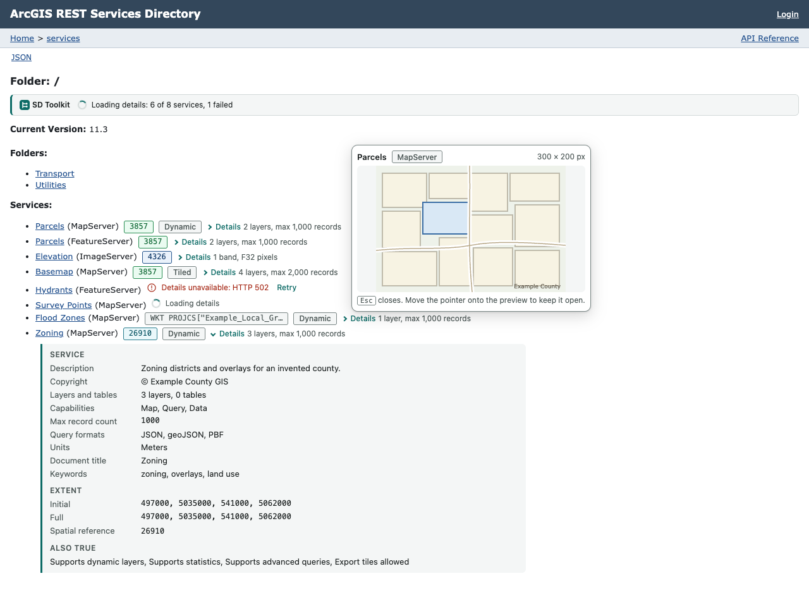

The gear becomes a one-line status bar in the page flow, directly under the page's `<h2>`. It shows the glyph, "SD Toolkit" and a message. It never covers anything, and it has no gear, because settings no longer live in the page.

**States** (see the component sheet):

- **Busy:** a spinner and "Loading details: 6 of 8 services, 1 failed".
- **Done:** a tick and "Loaded details for 8 services in 9 requests". The line stays, so admins can see what the extension asked their server for.
- **Budget reached:** warning tone, "Paused after 50 automatic requests. 8 layers not loaded yet." and a "Load 8 more layers" button (`images/after-service-layers.png`).
- **Server pushback:** error tone, "The server asked for fewer requests (HTTP 429). Automatic requests stopped on this page."
- **Nothing to do:** no bar. Query, find and print pages show none unless something fails.

It keeps everything Phase 3 asks of the indicator: an inline SVG, an accessible name, live status text, reduced motion, no click handler and the busy states the scripts already set. Its only button, Load more, starts work the page could start itself.

| WCAG 2.2 AA | How the status bar meets it |
|---|---|
| 1.4.3, 1.4.11 Contrast | Shared tokens, including warn and error tones on their own backgrounds (7.3:1 and 6.6:1 or more). |
| 1.4.1 Use of colour | Each tone has its own icon and words. |
| 1.1.1 Non-text content | Glyph and icons are decorative; "SD Toolkit" is text. |
| 1.4.4, 1.4.10, 1.4.12 | It wraps; the action moves to its own line when narrow. |
| 2.1.1, 2.1.2 Keyboard | Load more is a native button. |
| 2.4.3, 2.4.7 Focus | In the page's order, right after the heading. Shared ring. |
| 2.4.11 Focus not obscured | In the flow, so it can't cover a focused element. |
| 2.5.8 Target size | The button is at least 24 px tall. |
| 2.5.7 Dragging | None. |
| 1.3.1, 4.1.2 | A `
` with the message in a `
`. |
| 4.1.3 Status messages | The message is the live region. Updates are throttled to one a second so screen readers aren't flooded. |
| 1.4.13 | None. |
| 2.2.2 Pause, stop, hide | The spinner stops under reduced motion, and it stops when the work stops. |

### 6.4 Spatial reference badges

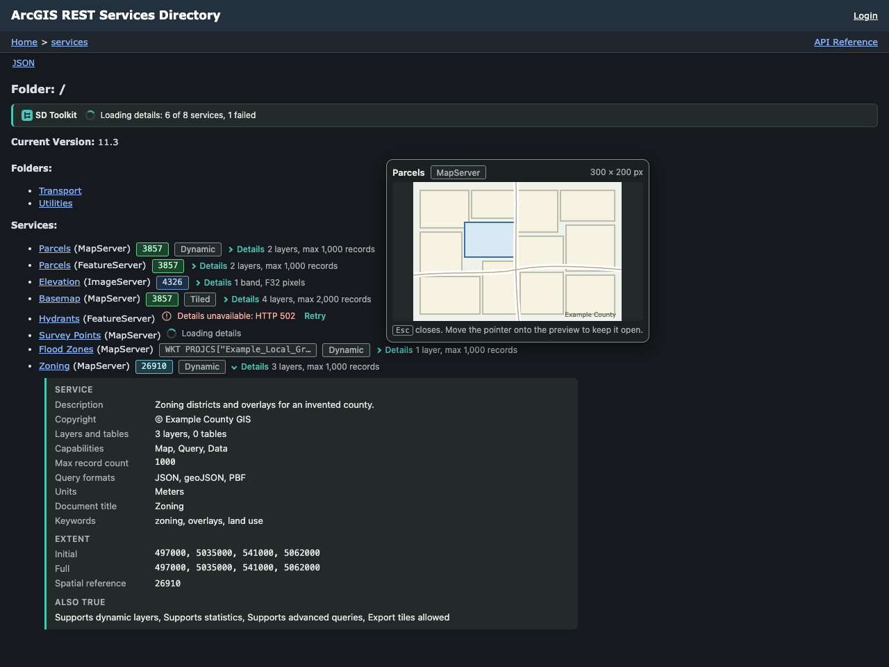

- **Colour:** the badge's colour set is `FNV-1a(String(latestWkid || wkid)) % 8`, one of eight tested colour sets. 3857 is always green and 4326 always blue, on every page and every visit. 102100 and 3857 share a colour because both read `latestWkid` 3857. The scheme meets the spec's "hash of the WKID, with at least 4.5:1".
- **Text:** the WKID in monospace. The link's accessible name is "Spatial reference 3857" through visually hidden text, and it goes to `https://spatialreference.org/ref/?search=3857` with the value encoded.
- **WKT only:** a neutral badge, "WKT" and the first 24 characters. The full text sits in `title` and in the details' Spatial reference row, which keyboard and screen-reader users can reach.
- **None:** no badge. The details say "No spatial reference".
- **Cache:** a neutral "Dynamic" or "Tiled" badge, only when `singleFusedMapCache` exists (MapServer), as the spec says.

| WCAG 2.2 AA | How the badges meet it |
|---|---|
| 1.4.3, 1.4.11 Contrast | Text at least 6.2:1 light and 8.7:1 dark. Borders at least 3.4:1 against the page and the details background, in both palettes. |
| 1.4.1 Use of colour | The WKID text is the information; colour only helps scanning. |
| 1.1.1 | No images. |
| 1.4.4, 1.4.10, 1.4.12 | Badges are inline and wrap with the row; only the minimum height is set. |
| 2.1.1, 2.1.2 | A plain link. |
| 2.4.3, 2.4.7 | After the service link in reading order. Shared ring. |
| 2.4.11 | In the flow. |
| 2.5.8 Target size | 20 px tall, but inline in a line of text, which the inline exception covers; neighbours are at least 8 px away. |
| 2.5.7 | None. |
| 1.3.1, 4.1.2 | Name "Spatial reference 3857" includes the visible text (SC 2.5.3). |
| 4.1.3, 1.4.13, 2.2.2 | Not applicable. |

### 6.5 Service and layer details

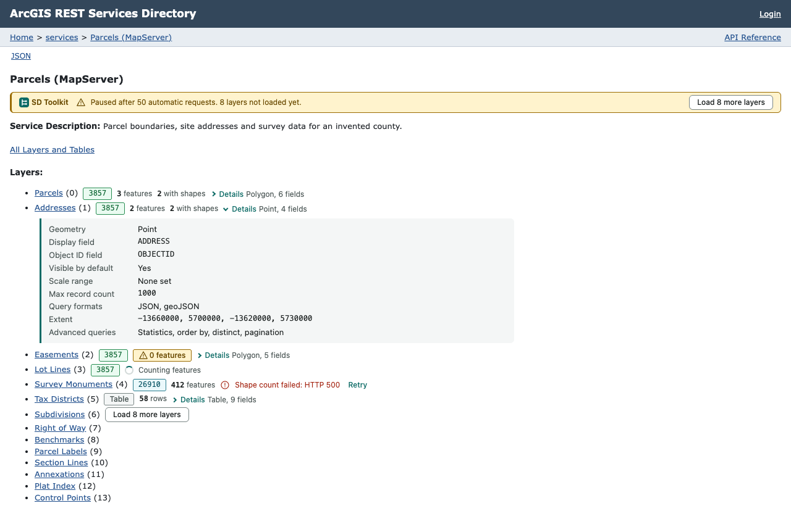

- **Control:** a native `
` whose `
` sits at the end of the service row ("Details" plus a short summary such as "2 layers, max 1,000 records"). A closed list stays one line per service. The open body drops below the row with the accent left rule.
- **Content:** a two-column definition list in groups (Service, Extent, Also true). Extents print as one line of four numbers in monospace. True flags join into one sentence. Max Record Count shows whenever it exists (INJ-13). Server HTML becomes text, and entities become characters (INJ-11).
- **Selection:** clicking inside the body selects text and doesn't close it. Only the summary toggles.
- **Loading:** "Loading details" with a spinner in the row. **Error:** "Details unavailable: HTTP 502" with a Retry button that names the service for screen readers. **Not loaded** (budget): the row stays plain until Load more.

| WCAG 2.2 AA | How the details meet it |
|---|---|
| 1.4.3, 1.4.11 Contrast | Shared tokens: muted labels 6.6:1 on the subtle background, the summary in accent 6.3:1 on white. |
| 1.4.1 | The chevron turns and the body appears; state doesn't rely on colour. |
| 1.1.1 | The chevron is CSS and decorative. |
| 1.4.4, 1.4.10, 1.4.12 | The grid falls back to wrapping; values break anywhere (`overflow-wrap: anywhere`), so long URLs don't push the page wider. |
| 2.1.1, 2.1.2 | `
` is focusable and toggles with Enter and Space. |
| 2.4.3, 2.4.7 | After the badges in the row. Shared ring. |
| 2.4.11 | In the flow. |
| 2.5.8 | The summary is at least 24 px tall. |
| 2.5.7 | None. |
| 1.3.1, 4.1.2 | Native disclosure exposes expanded and collapsed. `<dl>` pairs terms and values. Group labels are plain text, so 80 services don't add 240 headings. |
| 4.1.3 | Rows don't announce one by one. The status bar's live region reports progress and failures. |
| 1.4.13, 2.2.2 | None; the spinner follows reduced motion. |

### 6.6 Feature, field and coded-value counts

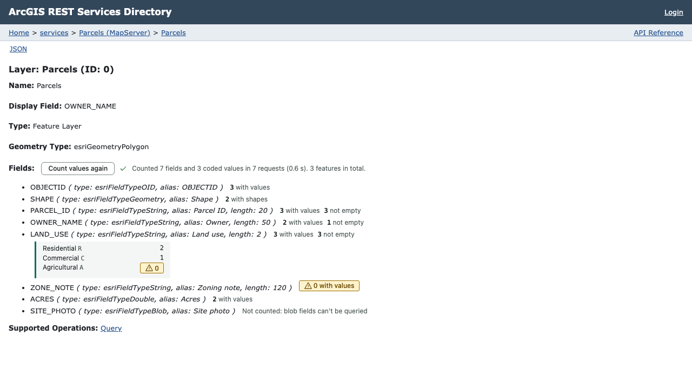

- **Per-layer counts (automatic, budgeted):** inline after the badge, "**3** features **2** with shapes", numbers in bold monospace. Tables say "rows". A layer with no features gets the warning badge "0 features" (today only field and code counts get "!!!").
- **Value counts (on demand):** a "Count values" button next to the page's "Fields:" label. After it runs, a status line reports what it did: "Counted 7 fields and 3 coded values in 7 requests (0.6 s). 3 features in total." The button becomes "Count values again".
- **Per field:** "**3** with values **3** not empty" at the end of the field's row. Fields that can't be counted say why ("Not counted: blob fields can't be queried").
- **Coded values:** a small two-column list under the field: name, code in muted monospace, count right-aligned.
- **Zero:** the warning badge with an icon, the number and words ("0 with values"), plus visually hidden "Warning:". It replaces the red "!!!".
- **Response times** move from every line to the one summary line, because the Phase 5 statistics query answers many fields at once.
- **Loading:** "Counting features" with a spinner, or a busy Count values button. **Error:** "Shape count failed: HTTP 500" with Retry. **Budget:** see 6.3.

| WCAG 2.2 AA | How the counts meet it |
|---|---|
| 1.4.3, 1.4.11 Contrast | Numbers in `--sdt-fg` at 16:1, labels muted at 7.1:1 on white and 8.1:1 on the dark stand-in, warning badge 7.3:1 with a 4.7:1 border. |
| 1.4.1 Use of colour | Zero has an icon, words and hidden "Warning:"; colour only repeats it. |
| 1.1.1 | Icons are decorative next to words. |
| 1.4.4, 1.4.10, 1.4.12 | Inline runs wrap. The coded-value list is as wide as its content. |
| 2.1.1, 2.1.2 | Count values and Retry are native buttons. |
| 2.4.3, 2.4.7 | Count values follows "Fields:"; Retry follows the error it fixes. Shared ring. |
| 2.4.11 | In the flow. |
| 2.5.8 | Buttons at least 24 px. |
| 2.5.7 | None. |
| 1.3.1, 4.1.2 | The coded-value list has an accessible name ("Coded value counts for LAND_USE"). Retry names its target in hidden text. |
| 4.1.3 Status messages | The Count values result line is `role="status"`; per-field results don't each announce. |
| 1.4.13 | None. |
| 2.2.2 | Spinners follow reduced motion and stop with the work. |

### 6.7 Query Helper and Find Helper

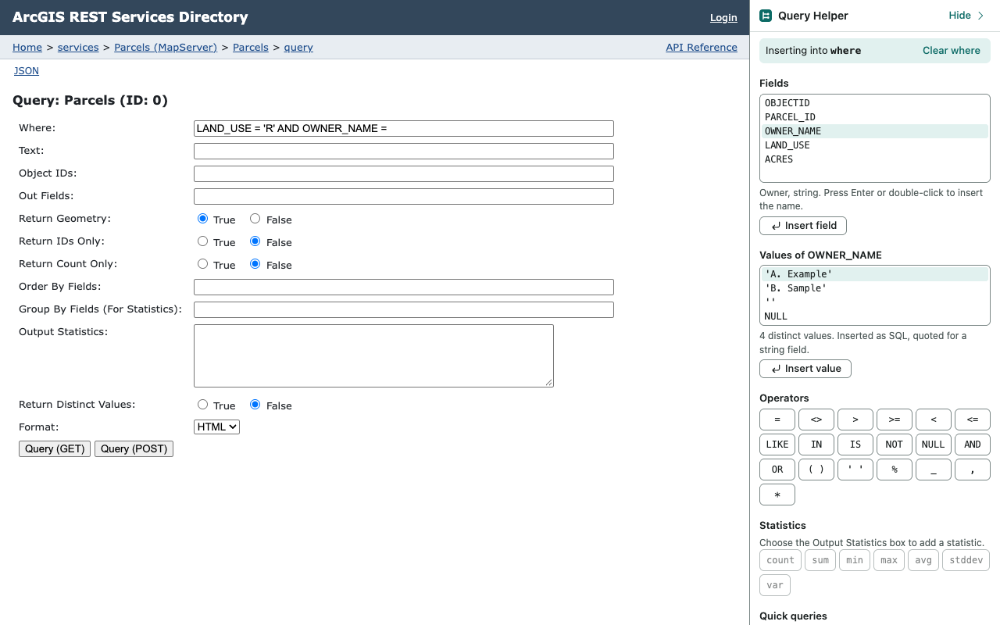

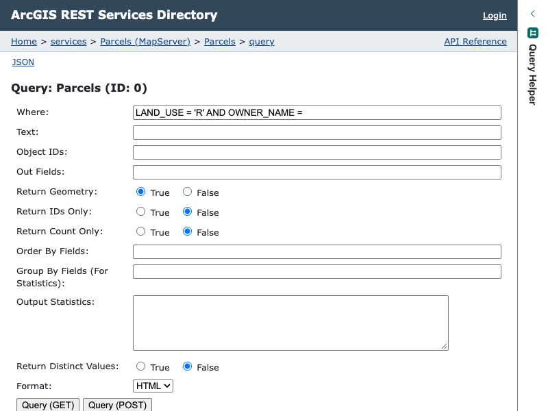

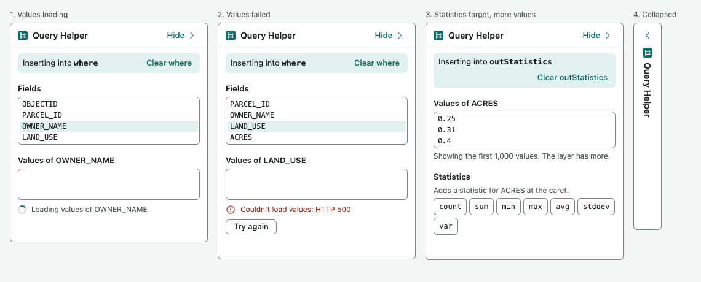

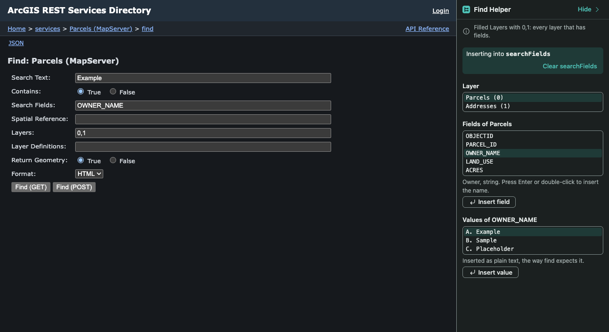

**Docking.** The panel is fixed to the right edge, full height, 20rem wide, and `html.sdt-docked` pads the page by the same width. The page reflows into the space left, and no field can end up under the panel, which settles SC 2.4.11. The body scrolls inside the panel (QRY-8). A Hide button collapses it to a 2.75rem strip and gives the space back. The panel starts open when the form fits beside it (`innerWidth - panel width >= form width`, measured once), and collapsed otherwise. In a window narrower than 40rem, as at 320 px, an opened panel goes into the page flow after the form at full width, because a 20rem column would leave the page no room. The choice isn't remembered, because content scripts don't write storage (spec 4.4). The panel can't be dragged or resized, so SC 2.5.7 doesn't arise.

**Query Helper, top to bottom:**

1. **Target bar:** "Inserting into **where**" and "Clear where". It shows where text will go, following `focusin` on the form and falling back to `where` (Phase 7).
2. **Fields:** a labelled listbox of field names. The hint shows the selected field's alias and type. Enter, double-click or "Insert field" inserts the name. Values load 300 ms after the selection settles, which stops arrowing through the list from sending a request per keypress.
3. **Values of FIELD:** a labelled listbox of SQL literals from the Phase 7 helper (`'A. Example'`, `''`, `NULL`). The hint says how many there are and that they're quoted for the field type. Enter, double-click or "Insert value" inserts. When the server has more, the hint says "Showing the first 1,000 values. The layer has more."
4. **Operators:** 19 buttons in a grid, 40 × 28 px, monospace. Symbols get names such as "Insert parentheses".
5. **Statistics:** always visible, disabled with the reason ("Choose the Output Statistics box to add a statistic") until Output Statistics is the target. Today they're hidden until focus.
6. **Quick queries:** "Select all", "All but geometry" and "Count only" carry a run icon and a hint that says what they do with the current setting ("These fill the form and run it with GET. Change this in All settings."). "Distinct values of FIELD" fills only. The asterisks go.
7. **Default where clause:** shown only when one is saved. The button carries the clause itself, "Insert STATUS = 'A'", and is Phase 7's Insert default.

**Find Helper:** the same panel and picker. A status line says what it did to the Layers box ("Filled Layers with 0,1: every layer that has fields."). Values go in as plain text, and there are no operators, statistics or quick queries.

**States:** loading values (spinner line, the list marked `aria-busy`), failed values (error line and Try again), empty ("No values"), no queryable fields ("This layer has no fields that can be queried"), disabled statistics, and collapsed.

| WCAG 2.2 AA | How the side panels meet it |
|---|---|
| 1.4.3, 1.4.11 Contrast | Shared tokens: listbox and button borders 3.7:1, selected option 14:1, quiet buttons on the target bar 5.4:1. |
| 1.4.1 Use of colour | The target is named in words. The selected option has a fill and the system selection state. Errors have icons. |
| 1.1.1 | Icons are decorative next to words. The collapsed strip's button is named "Show Query Helper". |
| 1.4.4, 1.4.10, 1.4.12 | When the form doesn't fit beside it, as at 200% zoom, the panel starts collapsed and takes a 2.75rem strip. Below 40rem it opens in the page flow at full width, and nothing needs scrolling in two directions. The open docked panel scrolls inside itself. Sizes are in `rem`. |
| 2.1.1, 2.1.2 Keyboard | Every insert works with Enter in the lists and with a button. Focus stays in the panel after an insert, so a clause can be built without leaving it. Tab leaves the panel normally, and Escape in a list returns focus to the target box. |
| 2.4.3, 2.4.7 | Tab reaches the form first, because the panel comes after the page's content in the DOM. Shared ring. |
| 2.4.11 Focus not obscured | Nothing focusable sits under the panel, because the page gives it its own column. Collapsed, it takes 2.75rem the same way. |
| 2.5.8 Target size | Operators 40 × 28 px, other buttons at least 24 px. Today's are 21 px tall. |
| 2.5.7 Dragging | No dragging or resizing; Hide and Show are buttons. |
| 1.3.1, 4.1.2 | An `<aside>` named by its `<h2>`. Listboxes have `<label>`s. Hide has `aria-expanded` and `aria-controls`. Disabled statistics point at their reason. |
| 4.1.3 Status messages | Value loading, failures and the Find Helper's Layers note are `role="status"`. Each insertion is announced politely ("Inserted 'A. Example' into where"). |
| 1.4.13 | None; `title` tooltips go. |
| 2.2.2 | The spinner follows reduced motion. |

### 6.8 Map preview

Behaviour follows #6: 250 ms delay on hover or focus, one at a time, cancelled by the next hover, closed by Escape or by leaving both the link and the pop-up.

- **Look:** a pop-up card with the service name and type in a neutral badge, the image size, the image on a subtle background, and a footer: "Esc closes. Move the pointer onto the preview to keep it open."
- **Position:** to the right of the row's last annotation (the Details summary), centred vertically on the link, and held below the page header. #6 says "right of the link text", and on rows with badges and a Details summary that spot would cover them (decision 9).
- **Loading:** the card opens at the image size with "Loading preview" and a spinner, so it doesn't jump. **Error:** "No preview: HTTP 500" or "No preview: this service has no export operation."
- **Alt text:** "Map preview of Parcels".

| WCAG 2.2 AA | How the preview meets it |
|---|---|
| 1.4.3, 1.4.11 Contrast | Shared tokens; the card border is 3.7:1 against the page. |
| 1.4.1 | Errors in words with an icon. |
| 1.1.1 Non-text content | Alt text names the service. |
| 1.4.4, 1.4.10, 1.4.12 | The card flips left or above, and shrinks the image to fit at narrow widths. |
| 2.1.1, 2.1.2 | Focus on the link opens it; Escape closes it; focus never enters it. |
| 2.4.3, 2.4.7 | Not focusable; the link keeps the shared ring. |
| 2.4.11 | It never covers the link that has focus (#6 acceptance criteria). |
| 2.5.8 | No targets in the card. |
| 2.5.7 | None. |
| 1.3.1, 4.1.2 | A plain container with an ``; no dialog role, because nothing in it takes focus. |
| 4.1.3 | Loading and failure lines are `role="status"`. |
| 1.4.13 Content on hover or focus | Dismissible with Escape, hoverable, and it stays until the pointer and focus leave (#6). |
| 2.2.2 | The spinner follows reduced motion. |

### 6.9 Print task controls

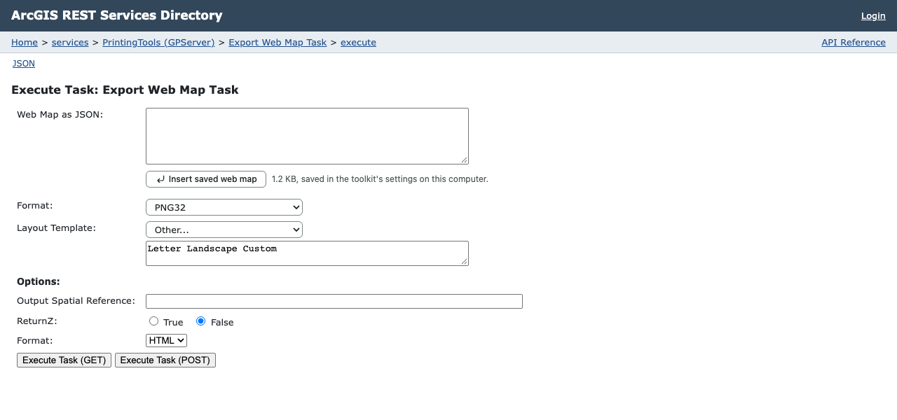

- **Choice lists** become compact `sdt-select` controls (24 px tall, 14rem wide) that take the page's `<label for>` (Phase 8). Optional parameters get "(none)". "Other..." shows the original box under the select, labelled "Layout Template, other value", and moves focus to it.
- **Web map:** "Insert saved web map" under the Web Map as JSON box, with the saved size and where it's stored. With nothing saved, the text reads "No saved web map. Add one in the toolkit's settings (toolbar button, All settings)." The extension can't link there, because Phase 3 removes the web-accessible resources a page link would need.
- **Errors** go to `console.debug` (Phase 8). The page shows nothing new.

| WCAG 2.2 AA | How the print controls meet it |
|---|---|
| 1.4.3, 1.4.11 | Shared tokens; select borders 3.7:1. |
| 1.4.1, 1.1.1 | No colour signals; the insert icon is decorative. |
| 1.4.4, 1.4.10, 1.4.12 | Sizes in `rem`; the hint wraps under the button. |
| 2.1.1, 2.1.2 | Native select, textarea and button. |
| 2.4.3, 2.4.7 | Each control sits where the page's box was. Focus moves to the box on "Other...". Shared ring. |
| 2.4.11 | In the flow. |
| 2.5.8 | 24 px. |
| 2.5.7 | None. |
| 1.3.1, 4.1.2 | The select takes the page's label; the revealed box gets its own. The hint is tied to the web map box with `aria-describedby`. |
| 4.1.3 | Inserting moves no focus; the box's new value is the feedback. |
| 1.4.13, 2.2.2 | None. |

### 6.10 Options page

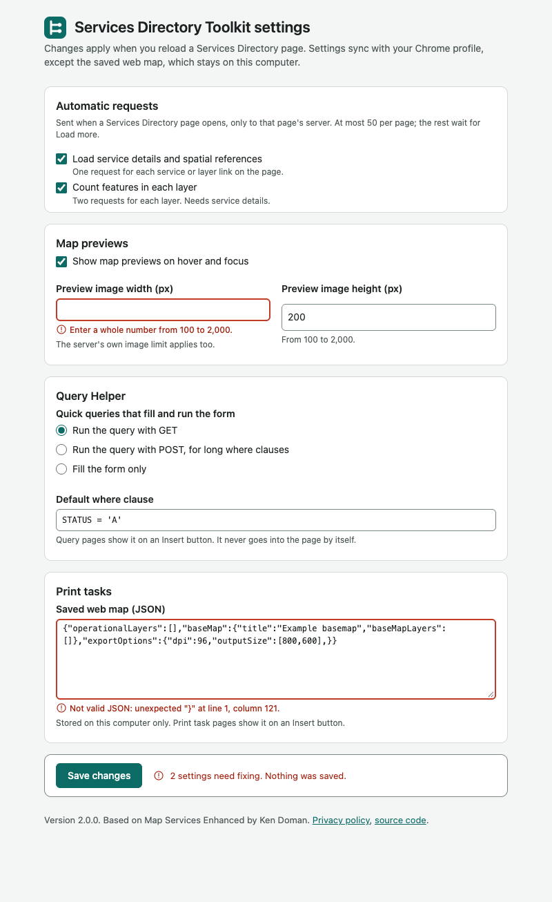

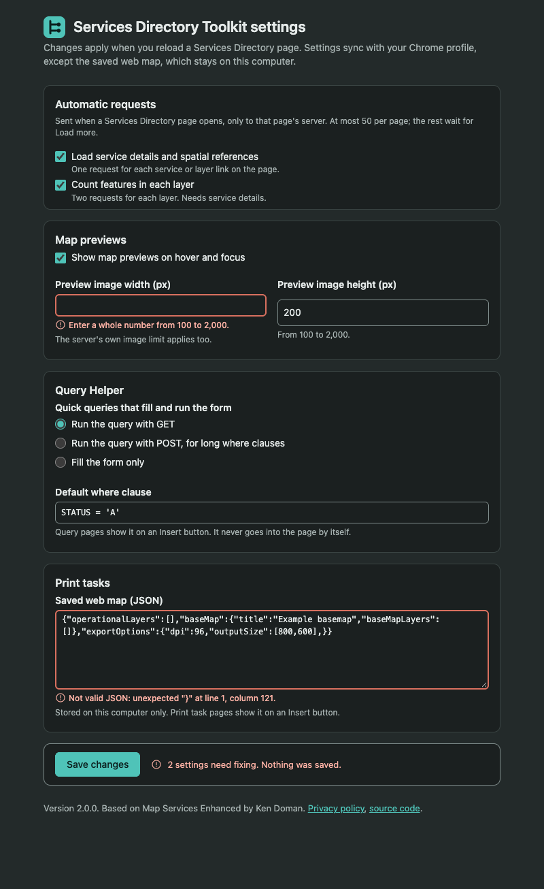

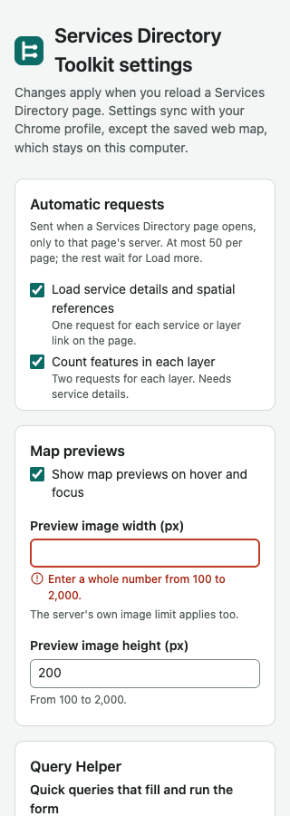

- **Layout:** one column, at most 42rem, on the subtle background. Header with the glyph, "Services Directory Toolkit settings", and a line saying changes apply on reload and the web map stays on this computer.
- **Sections:** cards for Automatic requests, Map previews, Query Helper and Print tasks. Each card has an `<h2>`. The Select All radios get their own fieldset and legend. Hints say what each setting costs or does.
- **Labels** come from the schema (table below). Units sit in the label ("Preview image width (px)"). The ranges in the mockup (100 to 2,000) are placeholders until Phase 4 fixes min and max.
- **Save:** a Save changes button at the end of the form, not sticky, with a status line. A sticky bar could cover the focused field and fail SC 2.4.11. On save, invalid fields show inline errors with `aria-invalid`, the status line says "2 settings need fixing. Nothing was saved.", and focus moves to the first invalid field. "Saved" appears only after the write succeeds (Phase 4).
- **About:** version, attribution to Map Services Enhanced and Ken Doman, links to the privacy policy and the source.

| Schema key | Label | Where |
|---|---|---|
| `autoMetadata` | Load service details and spatial references | Popup switch, options checkbox |
| `autoFeatureCounts` | Count features in each layer | Popup switch, options checkbox |
| `showMapImages` | Show map previews on hover and focus | Popup switch, options checkbox |
| `mapImageWidth`, `mapImageHeight` | Preview image width (px), Preview image height (px) | Options |
| `queryHelperSelectAll` | Quick queries that fill and run the form: Run the query with GET; Run the query with POST, for long where clauses; Fill the form only | Options |
| `defaultWhereClause` | Default where clause | Options |
| `defaultWebMapAsJSON` | Saved web map (JSON) | Options |
| `autoFieldCounts`, `autoDomainCounts` | Retired when Phase 5 makes value counts on demand (decision 2) | |

| WCAG 2.2 AA | How the options page meets it |
|---|---|
| 1.4.3, 1.4.11 | Shared tokens; checkbox and radio use `accent-color` with the accent at 6.3:1. |
| 1.4.1 | Errors have an icon, text and a thicker border. |
| 1.1.1 | The glyph is decorative. |
| 1.4.4, 1.4.10, 1.4.12 | One column; the size pair stacks below 24rem. Checked at 320 px (`after-options-320.png`). |
| 2.1.1, 2.1.2 | Native controls. |
| 2.4.3, 2.4.7 | Reading order. Shared ring. Focus goes to the first invalid field after a failed save. |
| 2.4.11 | Nothing fixed or sticky. |
| 2.5.8 | Inputs 32 px; checkbox and radio rows 24 px with the label as part of the target. |
| 2.5.7 | None. |
| 1.3.1, 4.1.2 | `lang`, `<h1>` and `<h2>`s, labels, the radio group in a fieldset with a legend, errors and hints tied by `aria-describedby`. |
| 4.1.3 Status messages | The save result is `role="status"`. |
| 3.3.1, 3.3.2 | Errors say what's wrong and what's allowed; every field has a label. |
| 1.4.13, 2.2.2 | None. |

### 6.11 Store assets

- **Icon (Track S):** build the toolbar and store icons on the same idea as the placeholder glyph, a small tree of entries on the teal accent, so the toolbar button, status bar and options page share one mark.
- **Promo tile (440 × 280):** the glyph and name on the accent, beside a crop of the status bar, badges and an open details block.
- **Screenshots (Phase 9):** `npm run screenshots` captures the real extension against the fake server, as `capture-before.js` does here, in both colour schemes. The mockups in this review are a target to check against, and the store images come from the shipped code.

## 7. Accessibility testing

**For every follow-up issue:**

- **axe-core:** `@axe-core/playwright` with `wcag2a`, `wcag2aa`, `wcag21a`, `wcag21aa` and `wcag22aa`, scoped to `.sdt` on host pages and to the whole popup and options page, in `colorScheme` `"light"` and `"dark"`. Zero violations.
- **Dark host page:** the fake server serves a dark `main.css` when a test asks for it, so tests can check that in-page additions switch palette. The dark block in `host-standin.css` shows the shape.
- **Keyboard-only tests:** each interactive feature driven with Tab, Enter, Space, arrow keys and Escape, with no mouse events.
- **Contrast:** `check-contrast.js` moves to `scripts/` and runs in CI, so a token change can't drop below AA.
- **Screen readers, once before release:** VoiceOver on macOS and NVDA on Windows, through the popup (search, results, switches, Reload page) and both side panels (target, lists, inserting, statistics).

**Already checked on the mockups:**

- axe-core 4.14 with the five tags above, scoped to `.sdt`: 22 page and scheme pairs, 0 violations. To confirm the scope worked, a planted unlabelled button and a 1.9:1 text span in a `.sdt` element were both reported.
- `check-contrast.js`: 116 checks, 0 failures.
- Reflow at 320 px for the options page, and the docked panel's reserved column at 800 px.

## 8. Fit with the spec

The proposal stays within the spec's decisions and requirements: vanilla JS, DOM construction through `SDT.loadElement` and `createElementNS`, shared code in `src/src/lib/`, no new automatic requests, and content scripts that never write storage. These points change or extend the spec. The last column names the decision in section 9, where one is needed.

| Spec | This proposal | Decision |
|---|---|---|
| Phase 3: the gear becomes a status indicator | Keeps its requirements, moves it into the page flow as a status bar and drops the gear glyph, in Phase 5 | 3 |
| Phase 3: popup gets an Options link | The link becomes "All settings" beside three quick switches, in Phase 9 | 1 |
| Phase 4: schema keys | `autoFieldCounts` and `autoDomainCounts` retire in Phase 5; label text from section 6.10 | 2 |
| Phase 6 and #6: pop-up right of the link text | Anchored after the row's annotations and centred on the link | 9 |
| Phases 7 and 8: Insert default buttons | Their handlers ignore clicks with `event.isTrusted === false`. A page script can call `.click()` on the button and then read the inserted value, which is the leak the button exists to stop. | 10 |
| Phase 7: picker | Adds "Insert field" and "Insert value" buttons beside Enter and double-click, and a 300 ms wait before loading values | None (fits) |
| Section 4.2: axe-core | Uses the WCAG 2.2 tags and both colour schemes, as issue #7 now asks | None (fits) |
| New | Reload page in the popup, from issue #7 | 1 |
| New | `SDT.theme`, the in-page theme check | 5, 6 |

## 9. Decisions needed from the owner

1. **Settings in the popup.** Recommended: option 2, three quick switches (service details, layer counts, map previews) from the Phase 4 schema, saved on change, with All settings and a Reload page button after a change. Alternatives: option 1, a full Settings view in the popup; option 3, the Options link only.
2. **Retire `autoFieldCounts` and `autoDomainCounts`.** Phase 5 makes value counts run from the Count values button, so both keys have nothing left to switch. Recommended: remove them from the schema in Phase 5 (nothing to migrate, because 2.0.0 is unpublished). Alternatives: keep them to hide the Count values button, or merge them into one "count coded values too" key.
3. **Status bar in place of the gear.** Recommended: a one-line status bar under the page heading, with no gear glyph, built in Phase 5 on top of the Phase 3 indicator. Alternatives: keep the Phase 3 fixed corner indicator with the toolkit glyph; or a corner chip that shows only while busy.
4. **Side panels.** Recommended: dock at the right in a column the page gives up, collapsible to a strip, open by default only when the form fits beside it. Alternatives: today's floating panel with a maximum height, which covers fields at narrow widths and fails SC 2.4.11; or the panel in the page flow after the form, which puts it far below the Where box.
5. **In-page theme.** Recommended: match the host page's computed background, re-checked when the page's styles change, while the popup and options page follow the system. Alternatives: follow the system preference; always light.
6. **Theme setting.** Recommended: none in 2.0.0, and add an `inPageTheme` key (Match page, Light, Dark) only if detection fails on real servers. Alternative: add it to the Phase 4 schema now, with System, Light and Dark for the extension pages too.
7. **Look.** Recommended: teal accent, system UI type, monospace for identifiers and numbers, 12 to 14 px sizes. Alternatives: inherit the page's font for in-page text; a blue accent, which sits too close to the page's links.
8. **Spatial reference colours.** Recommended: eight tested colour sets, picked by a hash of the WKID. Alternatives: a colour computed from the hash and corrected for contrast (unlimited colours, harder to test); one neutral colour for every badge.
9. **Map preview position.** Recommended: right of the row's last annotation, centred on the link, refining #6. Alternative: exactly as #6, right of the link text, which covers that row's badges and Details summary.
10. **Insert buttons ignore synthetic clicks.** Recommended: "Insert default where clause" and "Insert saved web map" check `event.isTrusted`. Alternative: the spec as written, where a page script can click the button to read the stored value.
11. **Where value counts go.** Recommended: inline at the end of each field's row, as today. Alternative: one summary table (field, with values, not empty, coded values) above the field list, which is easier to scan but repeats the page's list.

## 10. Proposed follow-up issues

Drafts only; none are created. Criteria are written to test, in the style of #6, and each surface issue carries its section 6 accessibility table as a criterion.

### 10.1 Shared style, theme check and accessibility test helpers

- **Labels:** `enhancement`, `accessibility`, `size:M`
- **Phase:** 5 (first, before the other Phase 5 issues)

**Problem.** Every surface styles itself (#7), and nothing knows about dark pages.

**Proposal.** Add `src/src/lib/sdt.css` from `docs/design/mockups/sdt.css`, loaded first by the content scripts, the popup and the options page. Add `SDT.theme` (section 5.2) and `SDT.icon`. Move `check-contrast.js` to `scripts/` and run it in CI. Add a dark `main.css` option to the fake server and an axe helper that runs the five WCAG 2.2 AA tags in both schemes.

**Acceptance criteria.**
- `node --test` covers the theme decision for a table of backgrounds: white, `#16191d`, transparent with and without `color-scheme: dark`, and a mid-grey that triggers `data-sdt-contrast="more"`.
- A browser test on the dark fixture page finds `data-sdt-theme="dark"` on `<html>`.
- `check-contrast.js` passes in CI and fails when a token is changed to a failing value.
- The build includes `sdt.css`; nothing else in `src/` changes appearance yet.

### 10.2 Status bar replaces the corner status indicator

- **Labels:** `enhancement`, `accessibility`, `size:S`
- **Phase:** 5

**Problem.** The Phase 3 indicator is fixed in a corner, where it can cover content, and the gear shape still suggests settings.

**Proposal.** Section 6.3: a status bar under the page heading with busy, done, budget-reached and pushback states, and Load more.

**Acceptance criteria.**
- The bar never overlaps page content; a bounding-box test checks it at 1280 × 800 and 800 × 600.
- The message is a `role="status"` live region, updated at most once a second.
- A 429 fixture shows the pushback message and stops automatic requests.
- Under `prefers-reduced-motion` the spinner doesn't animate.
- The bar itself has no click handler.
- Every row of the WCAG 2.2 AA table in section 6.3 holds, checked with axe in both schemes and a keyboard-only test.

### 10.3 Spatial reference badges from a tested palette

- **Labels:** `enhancement`, `accessibility`, `size:S`
- **Phase:** 5

**Problem.** Random colours fail contrast about half the time and change on every load (INJ-8). The link text lacks context, and the tiled/dynamic label shows on every service (INJ-14).

**Proposal.** Section 6.4.

**Acceptance criteria.**
- A unit test pins the palette index for 3857, 4326 and 102100, the last matching 3857.
- Badges meet 4.5:1 for text and 3:1 for borders in both palettes (contrast script).
- The accessible name is "Spatial reference N", the link is `https://` with an encoded value, and a WKT-only reference shows a truncated neutral badge with the full text in the details.
- "Dynamic" or "Tiled" appears only when `singleFusedMapCache` exists.
- Every row of the WCAG 2.2 AA table in section 6.4 holds, checked with axe in both schemes and a keyboard-only test.

### 10.4 Service and layer details in an inline disclosure

- **Labels:** `enhancement`, `accessibility`, `size:M`
- **Phase:** 5

**Problem.** The details toggle can't be used from the keyboard (INJ-9). Clicking inside closes it, and the content is a long flat list with literal entities (INJ-11, INJ-13).

**Proposal.** Section 6.5.

**Acceptance criteria.**
- Tab reaches each summary, and Enter and Space open and close it; `aria-expanded` follows (native `
`).
- Clicking or selecting text inside the open body leaves it open.
- No entity literals or HTML tags appear in the text.
- Loading, error with Retry, and not-loaded rows match the mockup.
- Every row of the WCAG 2.2 AA table in section 6.5 holds, checked with axe in both schemes and a keyboard-only test.

### 10.5 Feature and value counts: inline counts, zero warnings, Count values

- **Labels:** `enhancement`, `accessibility`, `size:L`
- **Phase:** 5

**Problem.** Zero is a red "!!!" that fails contrast and relies on colour. The lines are wordy, errors dump objects, and counting is automatic and unbounded (INJ-2, INJ-4, INJ-7, ADV-5).

**Proposal.** Section 6.6, with the Phase 5 statistics query behind Count values, and the removal of `autoFieldCounts` and `autoDomainCounts` if decision 2 is accepted.

**Acceptance criteria.**
- Zero shows the warning badge with an icon, text and hidden "Warning:"; no "!!!" remains.
- Count values reports requests and time in one `role="status"` line.
- Fields that can't be counted say why.
- The budget-reached and pushback states appear as in the mockups.
- Counts attach by field name (INJ-7).
- Every row of the WCAG 2.2 AA table in section 6.6 holds, checked with axe in both schemes and a keyboard-only test.

### 10.6 Map preview pop-up: look and states

- **Labels:** `enhancement`, `accessibility`, `size:S`
- **Phase:** 6, with #6

**Problem.** #6 decides behaviour and placement; the pop-up still needs a look, states and the anchor refinement.

**Proposal.** Section 6.8.

**Acceptance criteria.**
- The card shows name, type, size, image and the Escape hint.
- Loading keeps the card at the image size; failure shows a reason.
- The card is placed after the row's last annotation, and doesn't overlap that row's badges or summary (bounding-box test).
- Alt text is "Map preview of NAME".
- #6's criteria still pass.
- Every row of the WCAG 2.2 AA table in section 6.8 holds, checked with axe in both schemes and a keyboard-only test.

### 10.7 Docked side panel for the Query and Find Helpers

- **Labels:** `enhancement`, `accessibility`, `size:M`
- **Phase:** 7

**Problem.** The panel floats over the form, has no maximum height, and can hide a focused field (QRY-8, INJ-10, SC 2.4.11).

**Proposal.** Section 6.7 "Docking": one `SDT.panel` used by both helpers.

**Acceptance criteria.**
- With the panel open or collapsed, no form control's bounding box intersects the panel at 1280 × 800, 1024 × 768 and 800 × 600.
- Tabbing through every form field never leaves the focused element under the panel.
- Hide and Show work from the keyboard and expose `aria-expanded`.
- The panel starts collapsed when the form doesn't fit beside it.
- The panel is an `<aside>` named by its heading.
- Every row of the WCAG 2.2 AA table in section 6.7 holds, checked with axe in both schemes and a keyboard-only test.

### 10.8 Query Helper layout and keyboard use

- **Labels:** `enhancement`, `accessibility`, `size:L`
- **Phase:** 7

**Problem.** Inserting needs a double-click (QRY-6), the lists have no labels (QRY-7), the target is invisible (QRY-9), the SQL buttons are 21 px tall, and the asterisk meaning lives in a tooltip.

**Proposal.** Section 6.7, items 1 to 7, on top of the Phase 7 picker.

**Acceptance criteria.**
- A keyboard-only test builds `LAND_USE = 'R' AND OWNER_NAME = 'A. Example'` without the mouse.
- The target bar names the box that receives text and updates on focus.
- Operator buttons measure at least 24 × 24 px (40 × 28 proposed).
- Statistics are visible and disabled with a reason until Output Statistics is the target.
- Quick queries say whether they run, with GET or POST, from the setting.
- Insert default ignores synthetic clicks (decision 10).
- Every row of the WCAG 2.2 AA table in section 6.7 holds, checked with axe in both schemes and a keyboard-only test.

### 10.9 Find Helper layout

- **Labels:** `enhancement`, `accessibility`, `size:S`
- **Phase:** 7

**Problem.** The Find Helper shares the Query Helper's problems and fills the Layers box silently (INJ-3, INJ-10).

**Proposal.** Section 6.7 "Find Helper".

**Acceptance criteria.**
- The status line reports what went into Layers.
- Values insert as plain text into `searchText` or `searchFields`, whichever is the target.
- A keyboard-only test fills Search Text and Search Fields.
- Every row of the WCAG 2.2 AA table in section 6.7 holds, checked with axe in both schemes and a keyboard-only test.

### 10.10 Print task controls and Insert saved web map

- **Labels:** `enhancement`, `accessibility`, `size:S`
- **Phase:** 8

**Problem.** The new select has no label (PRT-6), the web map goes in by itself (SEC-2), and "Other..." doesn't move focus.

**Proposal.** Section 6.9.

**Acceptance criteria.**
- Each select is the target of the page's `<label for>`.
- "Other..." reveals a labelled box and focuses it.
- Insert saved web map inserts on a trusted click only and shows the "nothing saved" text when empty.
- Every row of the WCAG 2.2 AA table in section 6.9 holds, checked with axe in both schemes and a keyboard-only test.

### 10.11 Popup layout and states for search and Trim query URL

- **Labels:** `enhancement`, `accessibility`, `size:L`
- **Phase:** 9

**Problem.** POP-1 to POP-11: hangs, no labels, two tabs per click, raw JSON paths in results.

**Proposal.** Section 6.1, on top of the Phase 9 search and trimming fixes.

**Acceptance criteria.**
- Browser tests against the fake server reach each state in frames A to E of the mockup.
- Results show the matched text, a readable kind ("Field in") and the path, and open one tab.
- Search progress and counts are `role="status"`, and focus stays on the button.
- The popup reflows at 320 px when opened as a tab.
- Every row of the WCAG 2.2 AA table in section 6.1 holds, checked with axe in both schemes and a keyboard-only test.

### 10.12 Quick settings and Reload page in the popup

- **Labels:** `enhancement`, `accessibility`, `size:M`
- **Phase:** 9

**Problem.** Settings left the page in Phase 3, and the options page is several steps away from the page you're looking at (#7).

**Proposal.** Section 6.2, option 2, if decision 1 is accepted.

**Acceptance criteria.**
- Three switches show the stored values, save on change through the Phase 4 writer, and flip back with an error message on failure.
- The counts switch is disabled with its reason while details are off.
- After a change, Reload page reloads the tab and closes the popup.
- All settings opens the options page.
- A unit test ties the three keys to boolean schema entries.
- Every row of the WCAG 2.2 AA table in section 6.1 holds, checked with axe in both schemes and a keyboard-only test.

### 10.13 Options page layout

- **Labels:** `enhancement`, `accessibility`, `size:M`
- **Phase:** 9

**Problem.** The page is unstyled, and its structure doesn't group or explain the settings (section 2.9).

**Proposal.** Section 6.10, on top of Phase 4's validation.

**Acceptance criteria.**
- Labels match the table in 6.10.
- A failed save moves focus to the first invalid field and announces the count.
- The page works at 320 px and at 200% zoom.
- axe runs with and without errors showing.
- Every row of the WCAG 2.2 AA table in section 6.10 holds, checked with axe in both schemes and a keyboard-only test.

### 10.14 Store assets that match the UI

- **Labels:** `enhancement`, `size:S`
- **Phase:** 9, with Track S

**Problem.** The store icon, promo tile and screenshots should look like the extension people install.

**Proposal.** Section 6.11.

**Acceptance criteria.**
- The toolbar icon and the in-page glyph come from the same artwork.
- The promo tile uses the accent and glyph.
- `npm run screenshots` produces light and dark store screenshots from the real extension against the fake server.

### 10.15 Screen-reader pass before release

- **Labels:** `accessibility`, `size:S`
- **Phase:** 9

**Problem.** Automated checks miss announcement order, verbosity and focus handling.

**Proposal.** One manual pass with VoiceOver (macOS, Chrome) and NVDA (Windows, Chrome) over the popup and both side panels. File what it finds as issues.

**Acceptance criteria.**
- A short checklist in `docs/` covers search, results, the three switches, Reload page, the target bar, both listboxes, inserting, statistics and Hide.
- Every item passes in both screen readers, or has its own issue.

## 11. Regenerating the images

All images come from scripts in `docs/design/scripts/`, run from the repository root after `npm ci` and `npx playwright install --no-shell chromium`. They run headless and touch only the fake server and local files.

- **"Before" screenshots:** `node docs/design/scripts/capture-before.js` (about 50 s). It loads `src/` into Playwright's Chromium, answers every request from `tests/fixtures/fake-arcgis.js` with three extra routes (the stand-in stylesheet, `export`/`exportImage`, and an invented preview SVG), aborts every other host, and writes `images/before-*.png`.
- **"After" screenshots:** `node docs/design/scripts/capture-after.js` renders each mockup in both schemes to `images/after-*.png`. With `AXE_PATH=/path/to/axe.min.js` it also runs axe-core with the WCAG 2.2 AA tags and fails on any violation. axe-core isn't a repository dependency, so install it anywhere (`npm install axe-core`).
- **Contrast:** `node docs/design/scripts/check-contrast.js` prints the full table from section 4.3.

The mockups are plain HTML and CSS in `docs/design/mockups/` and open directly in a browser, where they follow the system's light or dark setting. `host-standin.css` is an invented page style; real Services Directory pages differ between 10.9 and 11.x, so the owner should compare the result against a real server by eye before Phase 5 starts.
